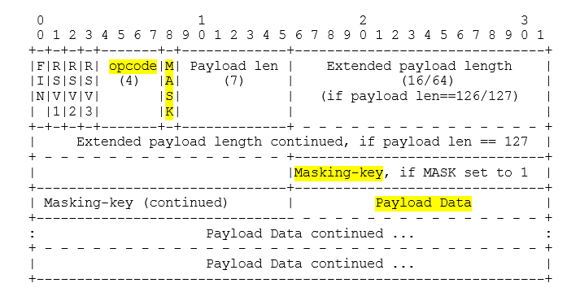

# WebSockets: Шпаргалка по устройству

## 1. Проблема обычного HTTP
*   **Модель:** "Запрос-ответ" (Half-duplex). Клиент спрашивает — сервер отвечает. Соединение рвется.
*   **Боль:** Сервер не может сам инициировать отправку данных браузеру (например, сказать: "Обнови таблицу, кто-то ее изменил").
*   **Костыли до WS:**
    *   *Polling:* Браузер спамит запросами каждую секунду ("Изменилось что-то? Нет? А сейчас?"). Сервер ложится от нагрузки.
    *   *Long Polling:* Сервер держит запрос открытым 30 сек. Если ничего не изменилось — отдает пустой `200 OK`, браузер делает новый запрос.

## 2. Как это решали до WebSockets (костыли):

*   **Polling (Опрос):** Браузер каждую секунду спрашивает: "Изменилось что-то? Нет? А теперь? Нет? А сейчас?". Сервер ложится от нагрузки, канал забит пустыми ответами `200 OK`.
*   **Long Polling:** Браузер спрашивает: "Изменилось что-то?". Сервер не отвечает сразу, а держит соединение открытым 30 секунд. Если за 30 секунд что-то изменилось — отдает ответ. Если нет — пишет `200 OK` (пустой), и браузер сразу делает новый запрос. Лучше, но все равно костыль с кучей лишних хедеров.

## 3. Что такое WebSocket?
*   **Модель:** Полный дуплекс (Full-duplex). Как по телефону: оба могут говорить и слышать одновременно в любой момент.
*   **Суть:** Это тот же самый TCP/IP, но с другими правилами игры.
*   **Главный миф:** WS **не заменяет** HTTP. Он использует HTTP для "рукопожатия", а затем они "договариваются" переключиться на другой протокол.

## 4. Рукопожатие (The Handshake)
Магия переключения с HTTP на WS происходит в 3 шага:

*   **Шаг 1. Браузер отправляет HTTP-запрос с спецзаголовками:**

    ```http
    GET /ws HTTP/1.1
    Host: excel.com
    Upgrade: websocket        # "Бро, я хочу обновить протокол"
    Connection: Upgrade       # "Поддержи обновление"
    Sec-WebSocket-Key: dGhlIHNhbXBsZSBub25jZQ==  # Случайная строка в Base64
    Sec-WebSocket-Version: 13 # Версия протокола
    ```

*   **Шаг 2. Traefik (твой Ingress) видит этот запрос.**
Traefik понимает: "Ага, `Upgrade: websocket`. Я не должен пытаться найти у этого запроса тело или проверять лимиты размера, я просто должен пропустить этот TCP-поток дальше к бэкенду как есть".

*   **Шаг 3. Твой FastAPI (бэкенд) принимает запрос.**
FastAPI (через Starlette/Uvicorn) видит заголовки, берет `Sec-WebSocket-Key`, добавляет к нему магическую строку из стандарта (RFC 6455: `258EAFA5-E914-47DA-95CA-5AB5DC3FA553`), хэширует это через `SHA-1` и возвращает ответ:

    ```http
    HTTP/1.1 101 Switching Protocols  # "Окей, переключаемся!"
    Upgrade: websocket
    Connection: Upgrade
    Sec-WebSocket-Accept: s3pPLMBiTxaQ9kYGzzhZRbK+xOo=  # Хэш, который браузер проверит
    ```

*   **Шаг 4. Магия.**
Как только браузер получает `101 Switching Protocols`, HTTP-протокол на этом соединении умирает. Больше никаких заголовков, никаких `GET / POST`, никаких статусов. Остается голый TCP-канал.

## 5. Как выглядят данные (Фреймы)
Так как заголовков больше нет, как сервер поймет, что ему прислали: текст, бинарник (картинку) или пинг?

Данные в `WebSocket` передаются фреймами (chunks). Каждый фрейм имеет крошечный заголовок (обычно 2-14 байт).

**Структура фрейма (упрощенно):**

*   **FIN (1 бит):** Это последний фрейм в сообщении? (1 = да, 0 = сообщение продолжается в следующем фрейме).
*   **Opcode (4 бита):** Тип данных. 0x1 — текст (UTF-8), 0x2 — бинарные данные, 0x8 — закрытие соединения, 0x9 — пинг, 0xA — понг.
*   **Payload length (7 или 16 бит):** Длина полезной нагрузки.
*   **Masking key (32 бита):** Об этом ниже.
*   **Payload:** Сами твои данные (например, `JSON {"cell": "A1", "value": 100}`).
Важная деталь про Masking:
По стандарту браузер обязан маскировать (шифровать простым `XOR`) любые данные, которые шлет серверу. Это защита от кэш-поisoning-атак (чтобы прокси-серверы в интернете не подумали, что это обычный HTTP-запрос и не закэшировали его). Сервер при получении обязан снять маску. А вот сервер браузеру шлет данные без маски.

## 5. Как не умереть (Ping / Pong)
TCP-соединение может "тихо умереть" (например, нат клиента в интернете отрубился, пакеты больше не идут, но `RST`-пакет не дошел).
Если никто ничего не шлет, ни сервер, ни браузер не узнают, что связь порвалась (могут висеть часами).

**Решение: Ping/Pong фреймы.**

Либо сервер, либо браузер периодически (раз в 20-30 секунд) шлет фрейм с Opcode: 0x9 (Ping) и случайными данными.
Вторая сторона обязана мгновенно ответить фреймом Opcode: 0xA (Pong), вернув те же самые данные.
Если ты послал 3 Ping'а и не получил Pong — соединение мертво. Ты разрываешь сессию и выводишь пользователю "Потеряно соединение с сервером".
