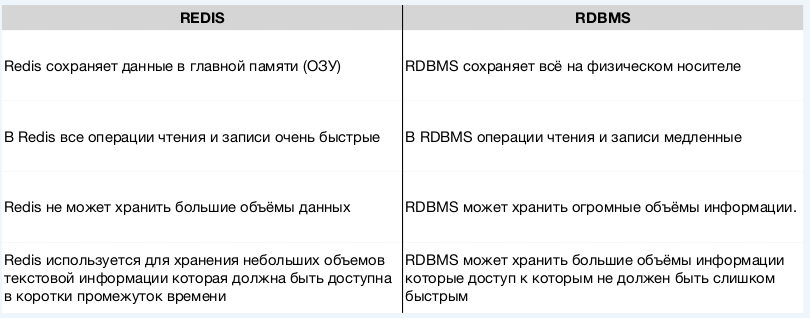
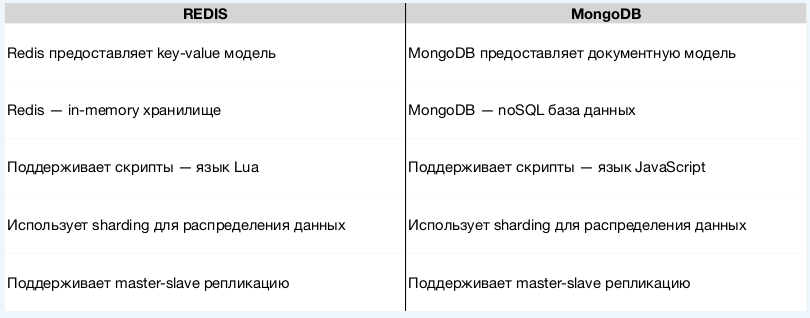

# Redis — Распределённое хранилище key-value данных.

## Происхождение 🚀

- 🚀 Первый релиз был опубликован в 2009 году
- Автор — Сальваторе Санфіліпо
- 🤝 Open source — финансирование VMWare.

### Особенности

- Open-source
- Поддержка многими языками программирования
- Cross-platform
- Написан на C

### Области применения

- 🌎 Хранилище сессий и профилей пользователей
- 📱 Сервер очередей
- 🏗 Место для хранения количества пользователей онлайн, поисковых запросов
- 💻 СУБД для небольших приложений
- ⌨ Хранилище промежуточных результатов вычислений при обработке больших
объемов данных

### Redis VS RDBMS



### Redis VS MongoDB



## RedisCLI

```bash
1. redis-cli <options> <command> # Выполнить конкретную команду Redis без необходимости входить в интерактивный режим.
2. redis-cli <options> # В этом случае redis-cli запускается в интерактивном режиме, где вы можете вводить команды Redis по одной.
```

### 1. Подключение

```bash
1. redis-cli -h <host> -p <port>
# Пример
redis-cli -h localhost -p 6379

2. redis-cli -u <URL>
# Пример
redis-cli -u redis://password@localhost:6379

3. redis-cli -a <password>

4. redis-cli -n 2 # Выполнит подключение ко второй базе (всего 16)
```

### 2. Повторение команды

```bash
redis-cli -r 10 incr counter 

user@user:~$ redis-cli -r 10 incr counter
(integer) 11
(integer) 12
(integer) 13
(integer) 14
```

### 3. Повторение команды + интервал

Интервал указывается в **секундах**

```bash
redis-cli -r 10 -i 0.5 incr counter
```

### 4. Чистый вывод

```bash
redis-cli --raw -r 10 -i 0.5 incr counter

user@user:~$ redis-cli --raw -r 10 -i 0.5 incr counter
21
22
23
```

### 5. Запись из файла

```bash
redis-cli -x set foo < /etc/services
```

- `-x`: Этот флаг указывает redis-cli читать данные из стандартного ввода (stdin). Это означает, что данные, которые будут установлены в Redis, будут считываться из файла или другого источника, а не передаваться в командной строке.

- `set foo`: Эта команда устанавливает значение для ключа foo. Если ключ уже существует, его значение будет перезаписано

### 6. Чистый вывод

```bash
redis-cli --eval /home/user/script.lua
```

- `--eval` Этот флаг указывает redis-cli, что вы хотите выполнить Lua-скрипт. Lua — это язык программирования, который Redis использует для выполнения скриптов на стороне сервера.
- `/home/user/script.lua` Это путь к Lua-скрипту,

### 7. Очистка

```bash
redis-cli flushall # Очистит данные со всех 16 бд.
```

### 8. Базовые операции

1. `select 2` - переключиться на 2 db  
2. `get counter` - получить значение по ключу `counter`  
3. `set counter` - установить значение по ключу `counter`  
4. `lpush mylist one two three four` - записываем данные в список
5. `redis-cli --csv lrange mylist 0 -1`- выводим результат в формате csv

```bash
# Пример №1
user@user:~$ redis-cli lrange mylist 0 -1
1) "four"
2) "three"
3) "two"
4) "one"

# Пример №2
user@user:~$ redis-cli --csv lrange mylist 0 -1
"four","three","two","one"
```

6. `redis-cli --stat` - получаем статистику по серверу  
7. `redis-cli  --latency` - для измерения и мониторинга задержки (латентности) операций в Redis.  
8. `redis-cli  --latency-history -i 5` - Эта опция позволяет отслеживать историю задержки. задержка будет измеряться каждые 5 секунд.
9. `redis-cli --bigkeys` - находим самые большие ключи и списки  
10. `redis-cli --scan --patter "*l"` - сканирует ключи, соответствующие шаблону

### Следующие команды только в интерактивном режиме

- Для подключения к удаленному серверу Redis по указанному IP-адресу  
`connect 18.195.151.104 6379`

- Аутентифицирует клиента  
`AUTH [username] [password]`

- Асинхронно сохранить данные на диск  
`BGSAVE`

- Получить список подключенных устройств :
`CLIENT LIST # Все варианты CLIENT [HELP]`

- Устанвить параметр конфигурации:
`CONFIG SET`  
  Пример:
  `CONFIG SET requirepass test` - используется для установки пароля, который требуется для аутентификации клиентов.
  
## Redis config

**redis.config** - главный конфигурационный файл Redis.

### 1. Основные настройки

**bind** — IP-адреса, на которых Redis слушает подключения (по умолчанию 127.0.0.1)

**port** — порт сервера (по умолчанию 6379)

**daemonize** — запуск в фоновом режиме (yes/no)

**pidfile** — путь к файлу с PID процесса

**loglevel** — уровень логирования (debug, verbose, notice, warning)

**logfile** — путь к файлу логов

### 2. Сохранение данных (Persistence)

**save** — правила для RDB-снимков (например, save 900 1 = сохранять если 1 изменение за 900 сек)

**appendonly** — включить AOF-лог (yes/no)

**appendfsync** — политика синхронизации AOF (always, everysec, no)

### 3. Безопасность

**requirepass** — пароль для доступа

**rename-command** — переименование опасных команд (например, FLUSHALL)

### 4. Ограничения

**maxmemory** — лимит оперативной памяти (например, 1gb)

**maxmemory-policy** — политика при достижении лимита:

- **volatile-lru** — удалять ключи с TTL по LRU

- **allkeys-lru** — удалять любые ключи по LRU

- **noeviction** — возвращать ошибки при переполнении\

**maxclients** — ограничивает максимальное количество одновременных клиентских подключений.

### 5. Репликация

**replicaof** — настроить реплику (указать master-сервер) (устаревшее название slaveof сохранилось для совместимости).

```bash
replicaof <master-ip> <master-port>
```

**replica-read-only** — разрешает/запрещает запись в реплику.

```bash
replica-read-only yes
```

**masterauth** — пароль для подключения к мастеру

### 6. Кластер

**cluster-enabled** — включить режим кластера (yes/no)

**cluster-config-file** — путь к файлу конфигурации кластера

## Пример redos.config

```bash
# Запустить сервер в фоне
# daemonize yes

# Указать определённый порт
port 7000

# Уровено логирования
# loglevel debug
# Указывает место куда выводить лог
# logfile ./redis.log

# Сохраняет данные на диск каждые 300с
# и если с прошлого сохранения произошло 10 изменений
# save 300 10

# устанавливает аутентификацию. lectrum ← пароль.
# requirepass lectrum

# Переименовывает команду
# rename-command config hiddenconfig

# Устанавливает максимальное количество клиентов
# Которые могут выполнять команды на сервере
# maxclients 1 

# Устанавливает максимальный размер занимаемый сервером в 2mb
# noeviction возвращает ошибку если достигнут лимит памяти
# volatile-lru удаляет ключ среди ключей с истечением срока действия, пытаясь удалить ключи, которые не использовались в последнее время.
# volatile-ttl удаляет ключ среди ключей с истечением срока действия, у которых не истекло время жизни.
# volatile-random удаляет случайный ключ среди тех, у кого установлено свойтсво expire.
# allkeys-lru так же как volatile-lru, но удалит все вид ключей, как обычные, так и ключи с свойтсвом expire.
# allkeys-random - удалит ключи для освобождения места, свойтсво expire не окажет никакого влияния.
# Используется в основной если мы конфигурируем наш сервер в качестве кеш сервера
# maxmemory 2mb
# maxmemory-policy allkeys-lru

# Указывает на сервер который будет мастером
slaveof localhost 6379
slave-read-only no
```

## Типы данных Redis


### List
