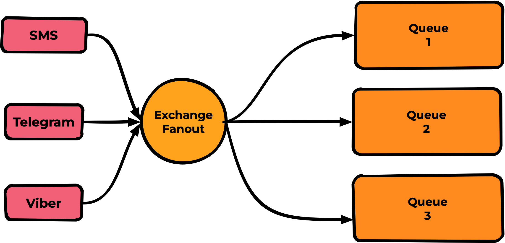
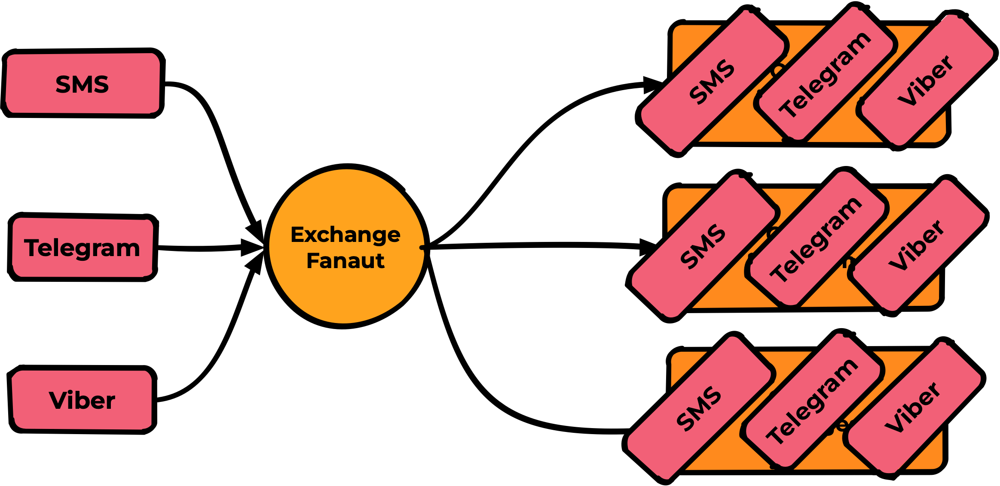
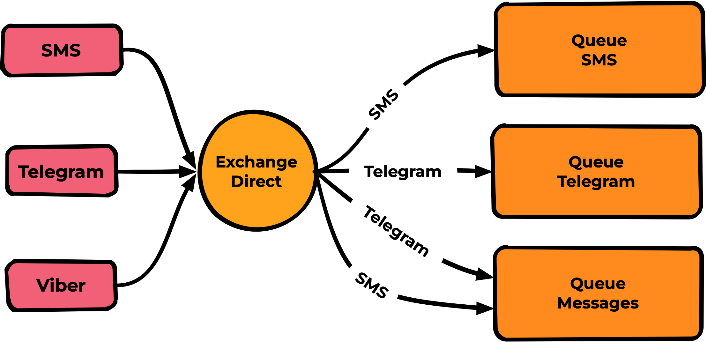
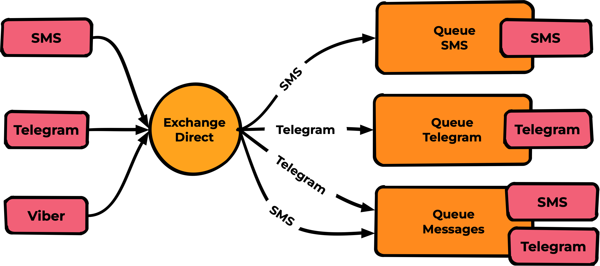
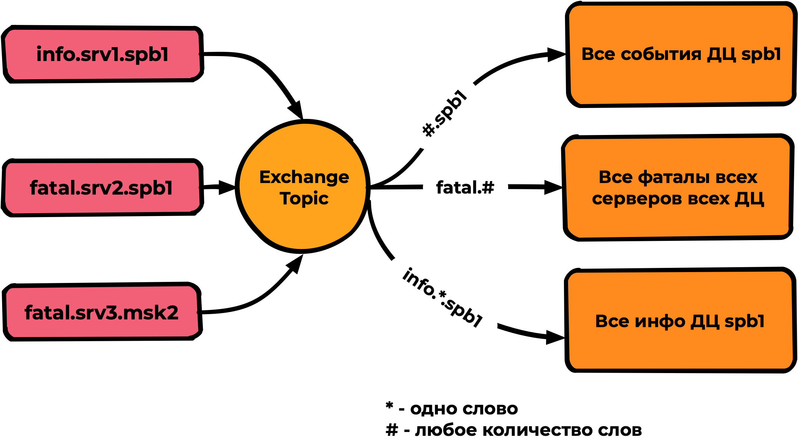
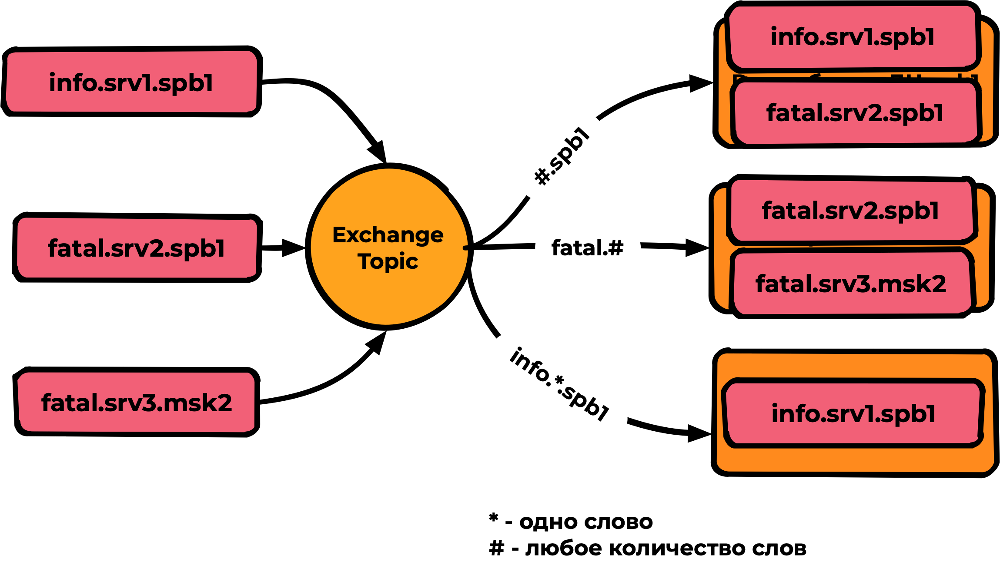
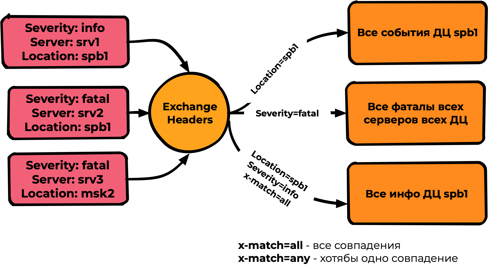
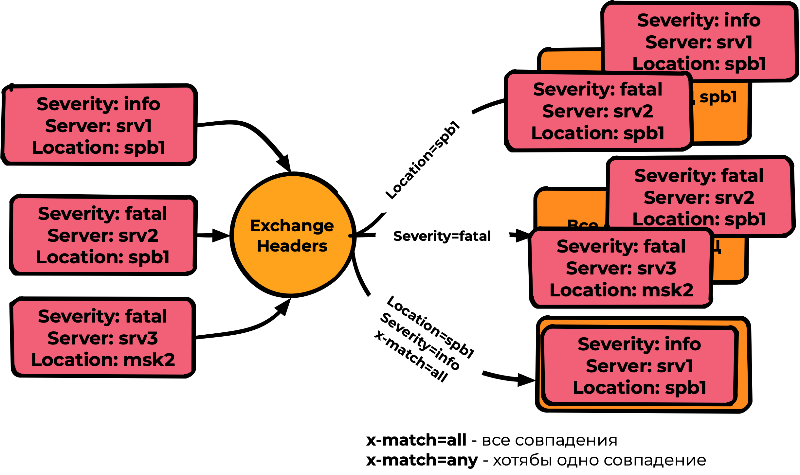

# Терминология, базовые сущности

## Введение

Почему важно знать теоретические основы?

Во-первых, вам будет значительно проще искать ответы на вопросы в Google и понимать официальную документацию. 

Во-вторых, при обращении в профильные чаты вы, называя вещи своими именами, значительно быстрее получите ответ (да и в принципе получите ответ, так как если ваши слова и термины будут не понятны другим, то они вполне могут и не ответить)

И в целом для понимания того, о чем пойдёт речь в дальнейших уроках этого курса - эти знания обязательны.

## Базовая схема

Базовая схема всех сущностей RabbitMQ

Слева направо пробежимся только по названиям:

**Publisher** - публикует (паблишит) сообщения в Rabbit.

**Exchange** - обменник. Cущность Rabbit, точка входа для публикации всех сообщений.

**Binding** - связь между Exchange и очередью

**Queue** - очередь для хранения сообщений

**Messages** - сообщение, атомарная сущность

**Consumer** - подписывается на очередь и получает от Rabbit сообщения

Также встретятся термины:

**Publishing** - процесс публикования сообщений в обменник.

**Consuming** - процесс подписывания consumer ****на очередь и получение им сообщений.

**Routing Key** - свойство Binding.

**Persistent** - свойство сохранения данных при перезагрузке сервиса (также известное как стейт).

## Publisher

Внешнее приложение (крон/вебсервис/что угодно) - генерирующее сообщения в RabbitMQ для дальнейшей обработки.

Создаёт соединение (**connection**) по протоколу AMQP, в рамках соединения создает канал (**channel**). В рамках одного соединения можно создать несколько каналов, но это не рекомендуется даже официальной документацией RabbitMQ.

**“Флаппинг” каналов** - если Publisher для каждого сообщения создает соединение, канал, отправляет сообщение, закрывает канал, закрывает соединение. Это очень плохая история, Rabbit становится плохо уже на ~300 таких пересозданий каналов в секунду. Будьте внимательны. Как решение, если нет возможности изменить Publisher - можно использовать [amqproxy](https://hub.docker.com/r/cloudamqp/amqproxy). 

> Важное замечание - **не следует использовать amqproxy для consumer**, есть проблемы одностороннего разрушения соединений.
> 

Publisher **может декларировать практически все сущности** - exchanges, queues, bindings итд итп. На нашей практике лучше подходит стратегия декларирования всех нужных сущностей consumer, но решать нужно для каждого проекта индивидуально.

Publisher **всегда пишет в exchange**, даже если вы думаете, что он пишет напрямую в очередь - это не так, он пишет в служебный exchange с routing key, совпадающим с названием очереди.

Publisher **определяет delivery_mode для каждого сообщения** - так называемый “признак персистентности” - это значит,  что сообщение будет сохранено на диске и не исчезнет в случае перезагрузки rabbit.

delivery_mode=1 - не хранить сообщения, быстрее.

delivery_mode=2 - хранить сообщения на диске, медленнее, но надёжнее.

Также publisher **определяет Routing Key для каждого сообщения** - признак, по которому идёт дальнейшая маршрутизация в rabbit.

Publisher может выставлять **confirm флаг - указания rabbitmq отправлять через отдельный канал подтверждения о успешной приёмке сообщений.** Например, если у rabbit закончится место на диске, то некоторое время он еще будет принимать сообщения от publisher и publisher будут думать, что всё в порядке, хотя сообщения уже с высокой долей вероятности не дойдут ни до consumer, ни сохранятся в очереди для дальнейшей обработки. Полезная вещь, но ощутимо снижает скорость работы и сложно реализуема в однопоточных языках разработки.

Также есть **флаг mandatory - указание rabbit**. **складировать сообщения не имеющие маршрута в какую-либо очередь в отдельный exchange**. Редкий и мало используемый кейс.

## Exchange

Базовая сущность RabbitMQ, по сути является точкой входа и машрутизатором/роутером всех сообщений (как входящих от Publisher, так и перемещающихся от внутренних процессов в rabbit)

**Неизменяемая сущность** - если нужно изменить параметры exchange, то нужно его удалять и декларировать заново.

> **Binding** - не являются частью exchange, их можно менять отдельно.
> 

**Рассылает сообщение во все очереди с подходящими binding** (но не более одного сообщения в одну очередь если есть несколько подходящих binding)

Durable/Transient - признак персистентности exchange, **durable - значит exchange** **сохранится после перезагрузки rabbit**.

**Exchange - не подразумевает хранения!** Это не очередь, если маршрут для сообщения не будет найден - сообщение сразу будет отброшено без возможности его восстановления.

Про типы exchange информация будет далее.

## Binding

Базовая сущность rabbit - по сути статический маршрут от exchange до queue (от обменника до очереди)

**Неизменяемая сущность** - если нужно изменить binding - нужно его удалять и декларировать заново.

Bindings между парой exchange-очередь может быть несколько, но только с разными параметрами.

Параметры binding - или routingkey или headers - в зависимости от типа exchange.

## Типы Exchange

После понимания, что же такое binding - вернемся к типам exchange, так как их работа неразрывно связана с binding.

Всего есть 4 типа exchange:

- Fanout
- Direct
- Topic
- Headers

Далее детально о каждом из типов:

### Fanout

Exchange публикует сообщения во все очереди, в которых есть binding, игнорируя любые настройки binding (routing key или заголовки)

Самый простой тип и наименее функциональный. Редко бывает нужен. По скоростям выдает на тестах около 30000mps, но столько же выдает и тип **Direct**

Пример работы:

Слева - сообщения, на них написаны Routing Key.

Все три сообщения попадут во все три очереди.

### Direct

Exchange публикует сообщения во все очереди, в которых Routing Key binding полностью совпадает с Routing Key Messages.

Наиболее популярный тип, по скорости сравнимый с fanout (на тестах не увидел разницы) и при этом обладающий необходимой гибкостью для большинства задач

Пример работы:

Здесь уже на binding мы видим routing key - согласно им происходит маршрутизация в нужные очереди.

Ожидаемый результат

### Topic

Тип Exchange, похожий на direct, но поддерживающий в качестве параметров binding Wildcard - * и #, где * - это совпадение одного слова (слова разделяются точкой), а # - любое количество слов. Производительность топика на тестах показала скорости в три раза ниже fanout/direct - не более 5000-10000mps

Пример использования:

Результат:

### Headers

Наиболее гибкий, но наименее производительный тип. Скорости очень сильно зависят от сложности условий и поэтому труднопрогнозируемы. Оперирует не routing key, а заголовками сообщений и binding. В binding указываются ожидаемые заголовки, а также признак **x-match,** где:

**x-match=all** - необходимы **все совпадения** для попадания сообщения

**x-match=any** - необходимо **хотя бы одно совпадение**

На сообщениях и binding написаны заголовки, не routing key!

## Queue

Базовая сущность RabbitMQ - представляет из себя последовательное хранилище для необработанных сообщений.

Хранение сообщений на диске (persistent) зависит от флага delivery_mode, назначаемым publisher для каждого сообщения.

Durable/Transient - признак персистентности очереди, **durable - значит queue сохранится после перезагрузки rabbit**. 

> Важно понимать, что даже если вы отправили сообщения с признаком delivery_mode=2 (persistent), но очередь задекларирована не как Durable, то при перезагрузке rabbit очередь и все содержащиеся в ней сообщения будут безвозвратно утрачены.
> 

Есть три типа очередей:

- **Classic** - обычная очередь, используется в большинстве случаев.
- **Quorum** - аналог классической очереди, но с обеспечением гарантий консистентности, достигаемый кворумом в кластере.
- **Stream** - новый вид очередей (начиная с версии rabbimq 3.9), пока еще мало кем используемый, аналог принципов apache kafka

## Message

Базовая сущность RabbitMQ - само сообщение, несет полезную нагрузку (payload), проходит весь путь от publisher до сonsumer.

Важные поля:

**payload** - полезная нагрузка, может быть как string, так и base64.

Можно закидывать туда хоть картинки, но потом не надо удивляться огромным трафикам между сервисами.

Теоретический лимит размера одного сообщения - это 2Gb, но на практике рекомендуемый размер сообщения это 128mb.

**routing key** - ключ маршрутизации, может быть только одно для одного сообщения

**delivery_mode** - признак персистентности

**headers** - заголовки сообщения. нужны для работы exchange типа headers, так и для всяческих дополнительных возможностей rabbit типа TTL.

## Consumer

Замыкает обработку consumer - демон, получающий сообщения из queue и выполняющий ту самую логику, ради которой сообщение проделало весь этот путь.

Например, отправка уведомления, запись в базу данных, генерация какого-то оффлайн отчета или отправка сообщения в какую-то другую queue.

Также как и publisher сonsumer создаёт соединение (**connection**) по протоколу AMQP, в рамках соединения создает канал (**channel**) и уже инициирует consuming в рамках этого канала.

Consumer **может декларировать практически все сущности** - exchanges, queues, bindings и тд. На нашей практике мы стараемся декларировать все сущности именно consumer, но решать нужно для каждого проекта индивидуально.

Consumer **подписывается только на одну очередь**. Если вы хотите получать сообщения из разных очередей - правильнее будет корректно смаршрутизировать их потоки в одну очередь, чем городить пулы consumer внутри приложения.

**Сообщения в сonsumer попадают по push-модели**, те протакливаются Rabbit в канал по мере их появления и (или) освобождения сonsumer. Никакой периодики, задержки - это жирный плюс.

**Prefetch count** - очень важный параметр сonsumer. Количество неподвержденных сonsumer сообщений в один момент. По умолчанию во многих библиотеках он равен 0 (по сути отключен) - в такой ситуации rabbit просто проталкивает все сообщения из очереди в сonsumer, а тот во многих случаях при достаточном количестве сообщений просто отъезжает.

Если нет понимания, какое значение ставить - лучше ставить “1”, пока сonsumer не обработает одно сообщение - следующее к нему не поступит. Как только rabbit подтвердит обработку - следующее сообщение будет получено незамедлительно.

Когда вы поймете, что у вас есть мультитред, что мы можете обрабатывать большие нагрузки - вы поднимете этот параметр, но уже осознанно, с пониманием.

Consumer может подтвердить обработку сообщения - механизм Acknowledge (ack) или же вернуть сообщение в queue при неудачной обработке - механизм Negative acknowledge (nack).

> Механизм nack также срабатывает автоматически при разрушении канала к consumer. Это удобно использовать - если на горячую выключить consumer - сообщения, которые он обрабатывал автоматически вернутся в очередь
> 

**AutoAck** - флаг автоматического подтверждения всех протакливаемых сообщений (не требует ack от сonsumer) - работает быстро, но не дает никаких гарантий успешной обработки сообщений.

## FIFO очереди

Основу rabbit представляют собой именно такие очереди

> FIFO = first in - first out
> 

Сообщения попадая в очередь выходят из неё в той же последовательности, что и вошли. Последовательность определяется моментом попадания сообщения в очередь, не бывает “одновременных сообщений” в рамках одной очереди, у них всегда есть порядок.

После выстраивания очереди по порядку мы переходим к “обслуживанию” этой очереди, по сути - “разгребанием”. Для этого подключается сonsumer (например, как открытие одного кабинета в очереди к врачу)

Если мы не укажем prefetch_count - его значение будет равным нулю и значит, что все сообщения протолкнутся в сonsumer и ничего хорошего обычно в таком поведении нет. (Ну как если бы открылся кабинет и все люди в очереди ввалились туда, решая свои вопросы)

Поэтому мы явно укажем **prefetch_count=1** и теперь без подтверждения более одного сообщения в сonsumer находится не сможет. 

Выглядит ожидаемо:

Далее после успешной обработки сonsumer выполняет “ack” для данного сообщения:

Rabbit получив ack удалит сообщение из очереди и незамедлительно протолкнет в сonsumer следующее сообщение (ну и так далее):

А если мы захотим увеличить скорость обработки? Мы можем поставить в “кабинете” еще один “стол с врачом” для этого укажем prefetch_count=2

Теперь будет идти обработка сразу двух сообщений. А если мы хотим еще быстрее? добавляем еще один сonsumer-кабинет (например с prefetch_count=1)

И так далее, общая концепция горизонтальной масштабируемости выглядит именно так.

## Полезные ссылки

Официальная документация rabbitmq (на английском языке)

[Documentation: Table of Contents](https://www.rabbitmq.com/documentation.html)

Чат в телеге русскоязычного комьюнити Rabbit

[Это RabbitMQ](https://t.me/rabbitmq_ru)