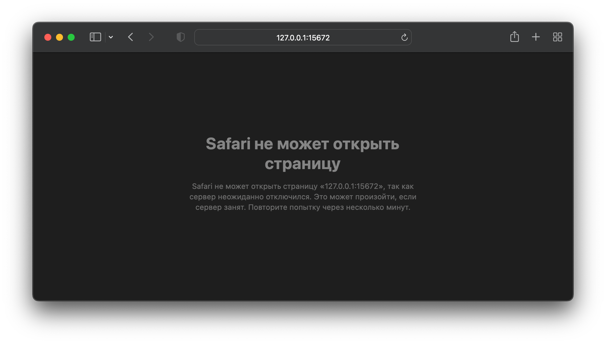

# Первые шаги

## Введение

Цель этого урока - научиться запускать RabbitMQ в докере, конфигурировать основные параметры для его запуска.

Также будет показана работа в консоли и в веб-интерфейсе.

> Запуск вне докера - не будет никак освещен и поддерживаться в рамках этого курса. Ставьте докер)
> 

## Запуск в docker

Самый простой и быстрый способ запустить RabbitMQ:

```bash
docker run --rm -p 15672:15672 rabbitmq:3.10.7-management
```

После этого можно уже открыть веб-интерфейс RabbitMQ в браузере по ссылке [http://127.0.0.1:15672](http://127.0.0.1:15672) если вы запустили его локально



Запуск даже пустого RabbitMQ занимает до 15 секунд, немного подождите и обновите страницу если увидите ошибку в браузере


Посе успешного запуска вы увидите окно авторизации

Пока авторизовываться не будем. Такой способ запуска не очень подходит для продакшен-решений, я рекомендую даже для локальной разработки использовать хотя бы docker-compose для работы с окружениями.

Создаём папку для окружения, например **stand**

```bash
mkdir stand
cd stand
```

Создадим файл **docker-compose.yml** со следующим содержимым:

```yaml
version: "2.1"
services:
  rabbitmq:
    image: rabbitmq:3.10.7-management
    ports:
      - 15672:15672
```

Запустим наш стенд командой

```bash
docker-compose up -d
```

Также можем попробовать открыть веб-интерфейс в браузере. Результат полностью аналогичен самому первому запуску через docker run

Теперь уже можем авторизоваться в веб-интерфейсе

> Логин и пароль по умолчанию - guest/guest
> 


После авторизации мы окажемся на главной странице веб интерфейса - overview

Обращаем ваше внимание на правый верхний угол:


В поле Cluster значение после @ - это имя сервера, назначенное автоматически докером для этого контейнера. 

Почему это плохо? RabbitMQ хранит стейт в папках, содержащих название сервера, а докер при пересоздании контейнера даёт ему случайные названия. Поэтому при каждом пересоздании контейнера RabbitMQ будет терять свой стейт и работать как новый, пустой.

Вот содержимое папки со стейтом:

```bash
MacBookPro:rabbitmq kilex$ docker-compose exec rabbitmq bash
root@2b70a6ecf6d3:/# ls -la /var/lib/rabbitmq/mnesia/
total 24
drwxr-xr-x 4 rabbitmq rabbitmq 4096 Oct 10 05:41 .
drwxrwxrwx 3 rabbitmq rabbitmq 4096 Oct 10 05:41 ..
drwxr-xr-x 5 rabbitmq rabbitmq 4096 Oct 10 05:44 rabbit@2b70a6ecf6d3
-rw-r--r-- 1 rabbitmq rabbitmq  194 Oct 10 05:41 rabbit@2b70a6ecf6d3-feature_flags
drwxr-xr-x 2 rabbitmq rabbitmq 4096 Oct 10 05:41 rabbit@2b70a6ecf6d3-plugins-expand
-rw-r--r-- 1 rabbitmq rabbitmq    2 Oct 10 05:41 rabbit@2b70a6ecf6d3.pid
```

Также использование авторизации по умолчанию (guest/guest) не считается хорошим тоном, поэтому давайте исправим эти два недочета внеся изменения в docker-compose.yml

Отключение стенда производится командой

```bash
docker-compose down
```

Добавим несколько строк в наш файл docker-compose.yml

```yaml
version: "2.1"
services:
  rabbitmq:
    image: rabbitmq:3.10.7-management
    hostname: rabbitmq
    restart: always
    environment:
      - RABBITMQ_DEFAULT_USER=rmuser
      - RABBITMQ_DEFAULT_PASS=rmpassword
    ports:
      - 15672:15672
```

Тут мы добавили поле **hostname** - которое зафиксирует имя сервера и переменные окружения с указанием логина и пароля для авторизации (**RABBITMQ_DEFAULT_USER** и **RABBITMQ_DEFAULT_PASS**)

> После применения этих изменений авторизация под guest/guest будет невозможна.
> 

Также я добавил строку **restart: always** - она дает указание докеру автоматически перезагружать сервис, в случае его внезапного остановления. (Полезно для прода, хотя на моей практике rabbit падал только при неправильном конфигурировании rabbit или по OOM)

Для применения изменений просто наберем ту же команду, она автоматически пересоздаст контейнер если есть изменения:

```bash
MacBookPro:rabbitmq kilex$ docker-compose up -d
Recreating rabbitmq_rabbitmq_1 ... done
```

Теперь авторизуемся уже под новыми реквизитами (rmuser/rmpassword) и проверяем правый верхний угол веб-интерфейса:


Теперь с авторизацией и именем сервера всё хорошо. Идём дальше.

Обращаем внимание на поле Disk space, в частности на low watermark. 


Эта настройка говорит о том, что RabbitMQ перейдёт в защиту и перестанет писать в стейт при свободном месте менее 48 мбит, что очень мало - этот порог пробивается в 90% случаев, а если реббит попытается записать на диск, где нет места - это с 90% вероятности уничтожит его стейт без возможности восстановления. Поэтому я настоятельно рекомендую для прод инсталяций переопределять это значение на хотя бы 2 гигабайта (2147483648 байт)

Это делается через переменную окружения **RABBITMQ_SERVER_ADDITIONAL_ERL_ARGS** и поле **disk_free_limitdisk_free_limit**:

```yaml
version: "2.1"
services:
  rabbitmq:
    image: rabbitmq:3.10.7-management
    hostname: rabbitmq
    restart: always
    environment:
      - RABBITMQ_DEFAULT_USER=rmuser
      - RABBITMQ_DEFAULT_PASS=rmpassword
      - RABBITMQ_SERVER_ADDITIONAL_ERL_ARGS=-rabbit disk_free_limit 2147483648
    ports:
      - 15672:15672
```

Также сразу предлагаю добавить volume для сохранения стейта rabbit локально на диск, чтобы стейт хранился на сервере а не только внутри контейнера:

```yaml
version: "2.1"
services:
  rabbitmq:
    image: rabbitmq:3.10.7-management
    hostname: rabbitmq
    restart: always
    environment:
      - RABBITMQ_DEFAULT_USER=rmuser
      - RABBITMQ_DEFAULT_PASS=rmpassword
      - RABBITMQ_SERVER_ADDITIONAL_ERL_ARGS=-rabbit disk_free_limit 2147483648
    volumes:
      - ./rabbitmq:/var/lib/rabbitmq
    ports:
      - 15672:15672
```

> ./rabbitmq значит, что папка со стейтом будет находиться в том же каталоге, где и файл docker-compose.yml. Что удобно, например, для переноса окружений на другой сервер - всё рядом, всё в одной папке.
> 

Применяем изменения:

```bash
MacBookPro:rabbitmq kilex$ docker-compose up -d
Recreating rabbitmq_rabbitmq_1 ... done
```

Проверяем:


Вот теперь хорошо

Пороговое значение, конечно, подбирается сугубо индивидуально в зависимости от параметров сервера и характера нагрузки, но для начала поставить 2 гигабайта это уже в 100 раз лучше чем значение по умолчанию.

Еще пара штрихов и мы будем полностью готовы к продакшен - инсталяции:

```yaml
version: "2.1"
services:
  rabbitmq:
    image: rabbitmq:3.10.7-management
    hostname: rabbitmq
    restart: always
    environment:
      - RABBITMQ_DEFAULT_USER=rmuser
      - RABBITMQ_DEFAULT_PASS=rmpassword
      - RABBITMQ_SERVER_ADDITIONAL_ERL_ARGS=-rabbit disk_free_limit 2147483648
    volumes:
      - ./rabbitmq:/var/lib/rabbitmq
    ports:
      - 15672:15672
      - 5672:5672
```

Тут мы открыли наружу AMQP порт 5672

> не всегда нужно, если консьюмеры и паблишеры находятся внутри этого docker-compose или подключены к его сети - публиковать порт нет необходимости
> 


## Консольные команды

Вход в контейнер с RabbitMQ (чтобы выполнять команды реббита надо находиться на сервере с rabbit)

```bash
docker-compose exec rabbitmq bash
```

**rabbitmqctl** - утилита, работающая без авторизации, может работать только локально рядом с rabbitmq. Нужна для обслуживания сервера/кластера в том числе для решения проблем.

Основные кейсы использования:

- Настройка кластера (будет отдельный урок по этой теме)
- Сброс авторизации (если, например, вы потеряли доступ к RabbitMQ или он к вам пришел исторически и реквизиты доступа вам не передавали)
- Принудительная очистка очередей - если веб интерфейс/amqp уже не отвечает из-за слишком большого количества сообщений в очередях

Можно посмотреть список очередей, exchanges

```bash
rabbitmqctl list_queues
rabbitmqctl list_exchanges
```

Можно удалить, почистить очередь. Но, например, создать очередь или удалить exchange - возможности нет. 

Список всех возможных команд

```bash
rabbitmqctl help
```

**rabbitmqadmin** - утилита, работающая через протокол AMQP (требует авторизации, но даёт более полный спектр возможностей)

Полезна для какой-либо автоматизации, и если по той или иной причине вам не удобно пользоваться веб интерфейсом

```bash
rabbitmqadmin help subcommands
```

Примеры команд:

```bash
rabbitmqadmin -urmuser -prmpassword declare queue name=console_queue
rabbitmqadmin -urmuser -prmpassword declare exchange name=console_exchange type=direct
rabbitmqadmin -urmuser -prmpassword declare binding source=console_exchange destination=console_queue routing_key=test
rabbitmqadmin -urmuser -prmpassword publish routing_key=console_queue payload="test message from rabbitmqadmin"
rabbitmqadmin -urmuser -prmpassword publish exchange=console_exchange routing_key=test payload="test message from rabbitmqadmin"
rabbitmqadmin -urmuser -prmpassword get queue=console_queue count=10
rabbitmqadmin -urmuser -prmpassword list queues
rabbitmqadmin -urmuser -prmpassword list exchanges
rabbitmqadmin -urmuser -prmpassword list bindings
```

Для экспорта всех сущностей (кроме сообщений) можно использовать команду экспорт

```bash
rabbitmqadmin -urmuser -prmpassword export backup.json
```

импорт аналогично

```bash
rabbitmqadmin -urmuser -prmpassword import backup.json
```

## Веб интерфейс

### Overview


Основная страница - Overview

Сверху справа - имя кластера@сервера, имя пользователя

Сверху - версия rabbit и erlang’а, чуть ниже - вкладки

- **Overview** - общие данные для всего кластера (в данном случае кластер из одной ноды)
- **Connections** - сведения о соединениях
- **Channels** - сведения о каналах
- **Exchanges** - сведения о exchanges
- **Queues** - сведения о очередях
- **Admin** - функции администрирования

Два верхних графика - общее количество сообщений во всех очередях в кластере

**Queued messages** - количественный показатель

- **Ready** - Сообщения, ожидающие обработки
- **Unacked** - Сообщения, переданные в консьюмер на обработку и ожидающие подтверждения.
- **Total** - Сумма Reade+Unacked

**Message rates** - показатель скорости обработки

- **Publish** - Скорость паблиша, записи сообщений в очереди
- **Consumer ack** - Скорость подтверждения обработки сообщений консьюмерами
- **Redelivered** - Скорость возвращения сообщений в очереди при неуспешной обработке (nack)


### Connections


Страница со списком соединений. На скриншоте 2 соединения (один от publisher, другой от consumer)

Внутри каждого соединения можно посмотреть индивидуальные графики и параметры, также там можно принудительно завершить соединение


### Channels


Страница со списком каналов. Всё аналогично списку соединений, только по сущности “канал”. Тут уже проще отличить канал консьюминга от канала паблишинга.

Внутри аналогично можно посмотреть подробности по каждому каналу


### Exchanges


Страница со списком exchanges. Видим,  как служебные exchanges, так и созданные вручную. Также на этой странице есть возможность создать exchange. Про каждый из параметров создания мы говорили на предыдущем уроке (теория)

Зайдя внутрь exchange - можно посмотреть нагрузку, посмотреть/создать/удалить биндинги до очередей


Также можно опубликовать сообщение в exchange, указав routing key. (delivery_mode при таком публиковании сообщений будет равен 2 - persistent)


### Queues


Страница со списком очередей. Пожалуй, самая активно используемая на практике.

> Рекомендую добавить столбец **Consumers** - показывающий кол-во подключенных к очереди консьюмеров, добавляется через кнопку **+/-**
> 

Внизу интерфейс создания новой очереди, параметры при создания мы проходили на уроке с теоретическими основами.

Если зайти в саму очередь - мы видим графики по кол-ву сообщений в конкретной очереди и по скорости публикации/обработки сообщений


Также мы видим список подключенных consumer и их prefetch_count. Нажатие на ip consumer откроет страницу его канала.

Ниже мы видим все биндинги в сторону этой очереди и возможность создать новый биндинг/удалить действующий


Есть возможность опубликовать сообщение в очередь (через служебный exchange). В отличие от публикации через exchange - есть возможность выбора Delivery mode.


Также в интерфейсе очереди можно получить N свободных сообщений из очереди


Если выбрать automatic ack - сообщения отобразятся и автоматически подтвердятся из очереди (это может быть полезно чтобы удалить одно проблемное сообщение из головы очереди.

## Полезные аргументы очереди

При создании очереди мы можем задекларировать аргументы, влияющие на её поведение. Например - мы можем задать TTL (время жизни) сообщений в этой очереди. Оно задается аргументом x-message-ttl в миллисекундах. Также например x-max-length отвечает за максимальную длину очереди и в зависимости от настройки x-overflow - сообщения или будут отбрасываться с головы(drop-head, по умолчанию) или, как на скриншоте - будут отдавать ошибку publisher


### Policy

Возможность добавлять атрибуты очереди/exchange без передекларирования оных.

Например, для очереди inbox мы хотим добавить максимальную длину и TTL на хранение сообщений, создаём такой policy (на вкладке admin)


> Не рекомендую использовать priority 0 - теряем возможность гибко создавать более и менее приоритетные policy. Обычно первую policy я создаю с приоритетом 5.
> 

Только одно policy может действовать одновременно на одну очередь. Те мы можем создать одну общую policy для всех (удобно для кластера) но при создании более частных политик - нужно делать им приоритет выше и перечислять все параметры которые мы использовали для общего списка.

Проверяем очередь, видим действующую политику:


> Если у очереди уже есть действующие аналогичные политики - действовать будет та которая наступит раньше. (Меньший TTL/меньшая длина очереди)
> 

### Admin

Вкладка для администрирования некоторых параметров RabbitMQ


В частности

- **Users** - управление пользователями и их правами
- **Virtual Hosts** - управление виртуальными хостами (изолированые окружения внутри одного кластера)
- **Feature Flags** - отображение включенного функционала реббита
- **Policies** - policy, описано выше
- **Limits** - настройки ограничений
- **Cluster** - параметры кластера (по факту только названия)