# Типовое использование

## Введение

Цель этого урока - узнать о типовых архитектурных паттернах использования RabbitMQ и научиться настраивать их на практике. В частности, опишу как настраиваются pipeline обработки и реализацию очереди повторных попыток (в том числе, через механизм dead letter exchange)

Также с этого урока у нас появятся настоящие publishers и consumers. 

## Pipeline

Базовый элемент архитектуры - когда нужна последовательная обработка различными сервисами. 

Например, первым этапом нам надо проверить авторизацию, затем произвести дедупликацию и уже после этих этапов произвести запись данных сообщения в базу данных.

За счет использования очередей в пайпла хорошо видны так называемые bottleneck’и - узкие места пайплайна в очередях перед которыми скапливаются сообщения на обработку. Также есть понятный механизм расшивания - увеличением количества консьюмеров (конечно же это не серебряная пуля - тк проблемы могут быть у другого сервиса типа БД)

Также подобный подход удобен возможностью удобного траблшутинга - можно на любом этапе добавить дублирующую очередь и получать копии сообщений туда - как для разбора так и для отправки на непродовые окружения.


Вот типовой пример pipeline обработки. Publisher отправляем сообщения и потом оно передается от worker к worker по мере обработки.

Например, worker  1 - проверяет авторизацию, 2 - дедупликатор, 3 - пишет в бд.

С очередями картинка выглядит чуть посложнее, но суть таже:

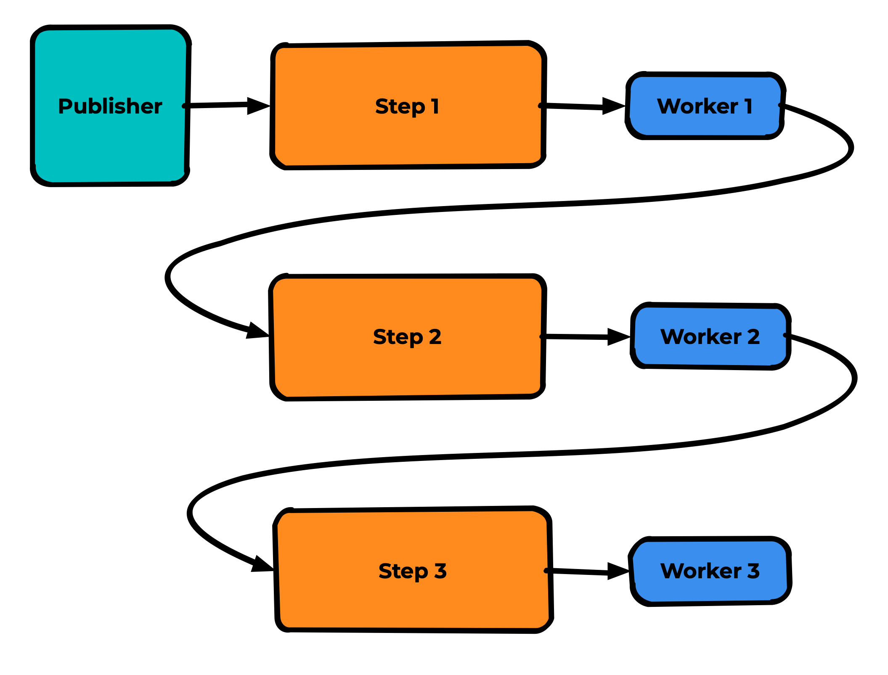

> Здесь и далее я не рисую exchanges перед очередями, но надо понимать, что они везде есть. Опускаю их только для упрощения схемы, если это возможно.
> 

Важно понимать, что worker 1 и worker 2 на данной схеме являются одновременно и consumer и publisher.

А что произойдёт, если worker 2 перестанет справляться с дедупликацией сообщений? Например, код проверки написан не оптимально и скорость проверки занимает даже немного, но больше времени, чем частота прихода новых сообщений.

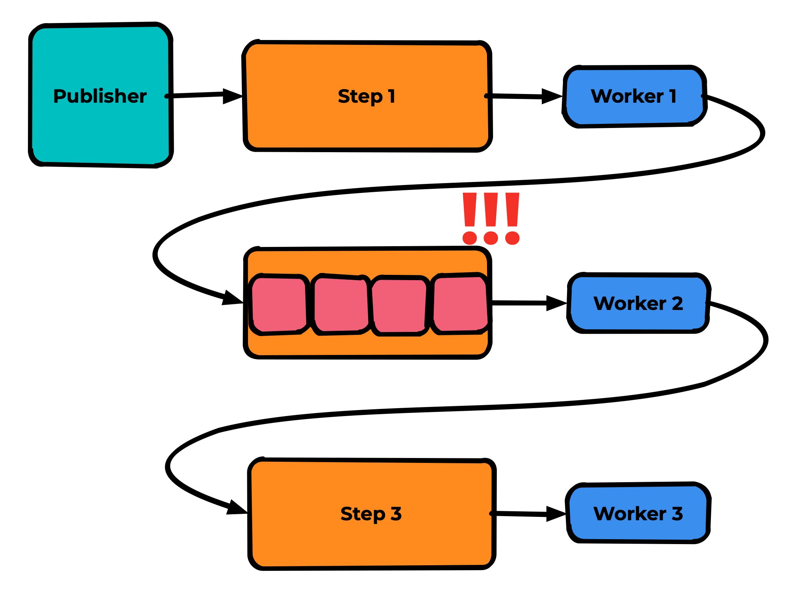

Тогда очередь сообщений перед worker 2 начнет расти. О чем нам, конечно же,  должно прийти уведомление от системы мониторинга.

Если есть возможность горизонтального масштабирования - мы просто запускаем еще один интсанс worker 2

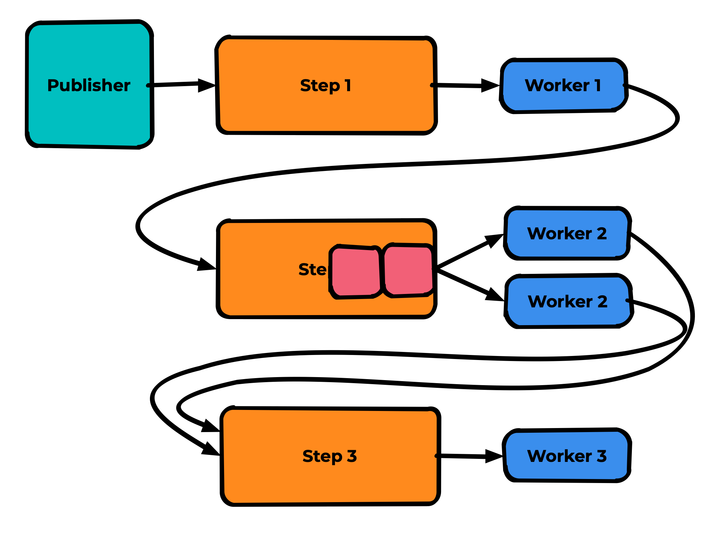

И они вдвоём могут ускорить обработку сообщений. Понятное дело, что так не всегда получится ускорить обработку - например, если эти воркеры упираются в скорость используемой ими бд - надо расшивать её или оптимизировать их код, но по крайней мере узкое горлышко обработки вы будете видеть сразу.

## Очередь повторных попыток

Один из базовых элементов архитектуры приложения. Используется когда есть вероятность не успешной обработки сообщения (как в целом “временные трудности”, так и временные проблемы с обработкой конкретного сообщения)

Работает только если нет необходимости в строгой последовательности обработки - тк подразумевает возможность временного пропуска сообщения.

Есть два основных алгоритма реализации очереди повторных попыток

- ack+publish - когда consumer сам подтверждает сообщение из основной очереди и паблишит в очередь повторных попыток
- reject+dlx - через механизм dead letter exchange

### Dead Letter eXchange

Далее надо немного углубиться в механизм DLX - Dead Letter eXchange

- Это свойство очереди - как явное, так и назначенное через Policy.
- Указывает RabbitMQ куда необходимо отправлять сообщение при наступлении одного из событий:
    - x-mesage-ttl - превышение времени жизни
    - x-max-length - превышение длины очереди
    - reject - явный реджект сообщений со стороны консьюмера
- Для одной очереди можно указать только один DLX,  что несколько снижает гибкость
- Также можно указать dead-letter-routing-key (а что важно - можно и не указывать, тогда сохраняется текущий для каждого сообщения)

### Пример ack+publish

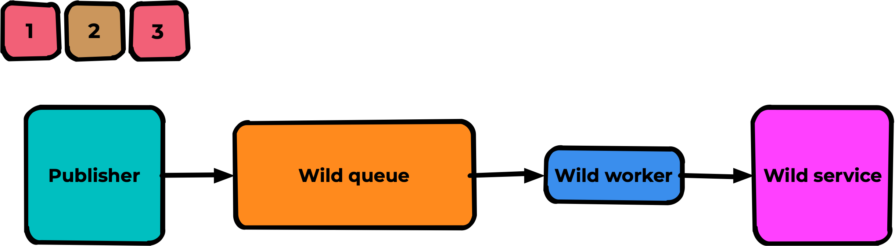

Например, у нас есть обработка сообщений использующая некий внешний сервис, вне нашей зоны отвественности. И пусть к примеру сообщение “2” в данный момент не может быть им успешно обработано.

Сообщения помещаются в очередь:


Worker берет 1 сообщение в обработку:


После успешной обработки 1го сообщения доходит дело до второго, проблемного. Происходит ошибка его обработки:

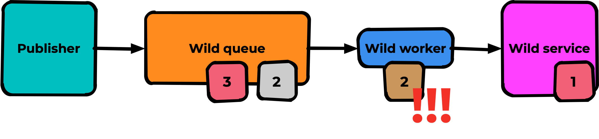

Например, если мы сделаем nack этому сообщению - оно вернется в очередь на тоже самое место:

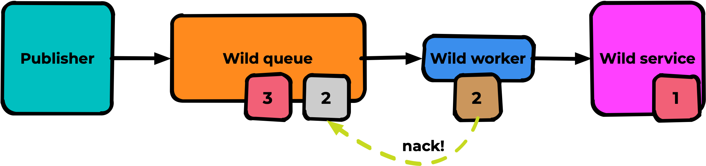

И оно незамедлительно будет закинуто в воркер:

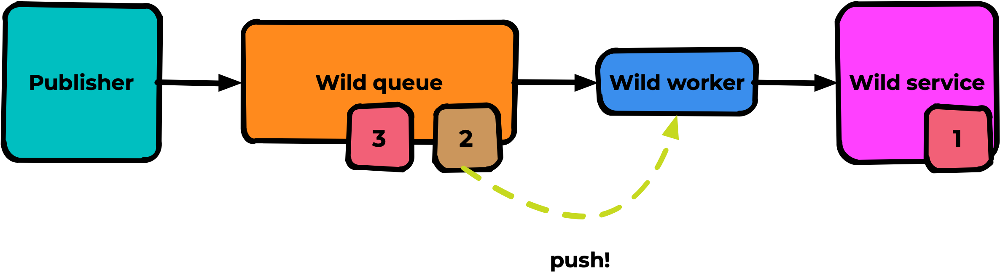

Где его почти наверняка снова ждёт неуспешная обработка. И вот пока одно сообщение будет бегать туда сюда - оно как тромб забьёт голову очереди и все сообщения, которые могли бы быть обработаны - будут висеть в очереди и ждать своего часа:

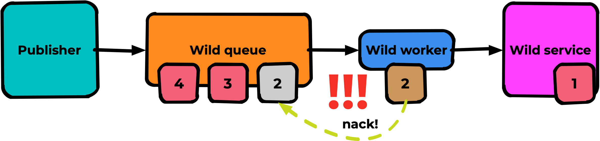

Вот как раз для таких случаев и пригождается паттерн очереди повторных попыток. Суть в том что мы создаем дополнительную очередь “retry queue” - куда складируем неуспешно обработанные сообщения:

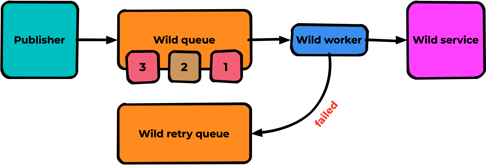

И в случае ошибки обработки worker должен сделать ACK из основной очереди и publish в новую очередь:

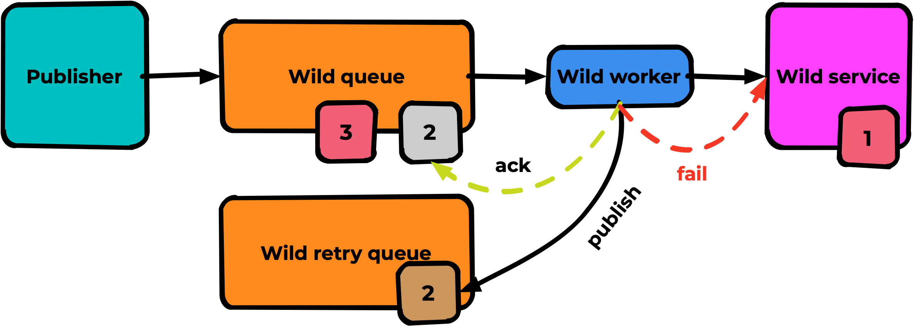

В результате для нашего примера 1 и 3 сообщения будут успешно обработаны а 2 - останется в выделенной очереди ожидать своего часа:

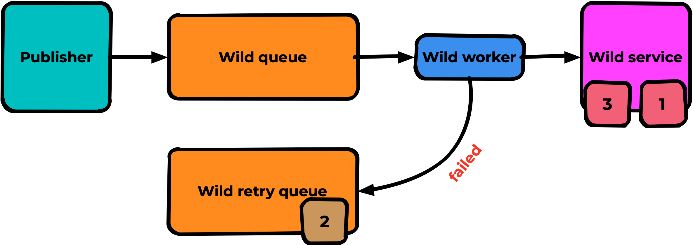

Это как раз подход ack+publish - наиболее часто используемый в IT-системах в основном, потому что разработчики не знают о некоторых возможностях RabitMQ. Я же рекомендую использовать второй метод, который использует reject+DLX. 

### Пример reject+dlx

Всё аналогично, но для очереди мы декларируем DLX = Fail, который ведет в ту самую очередь повторных попыток:

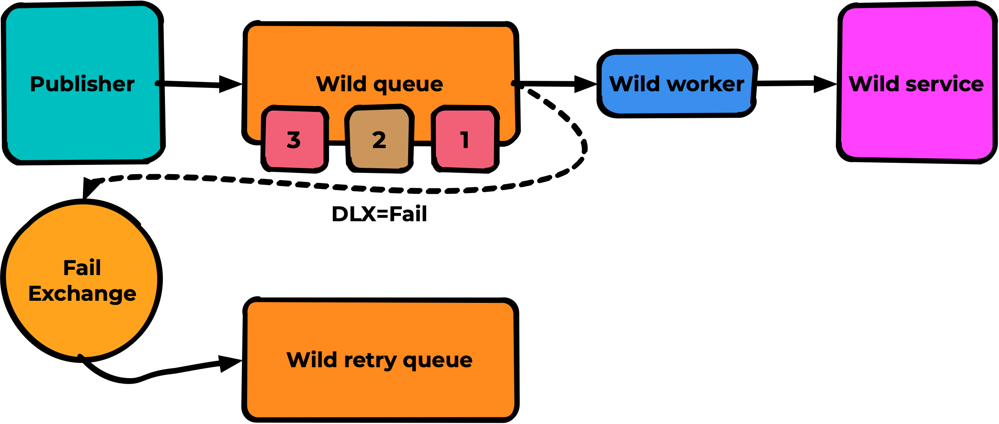

И при неуспешной обработке мы делаем reject(false) вместо ack и publish:

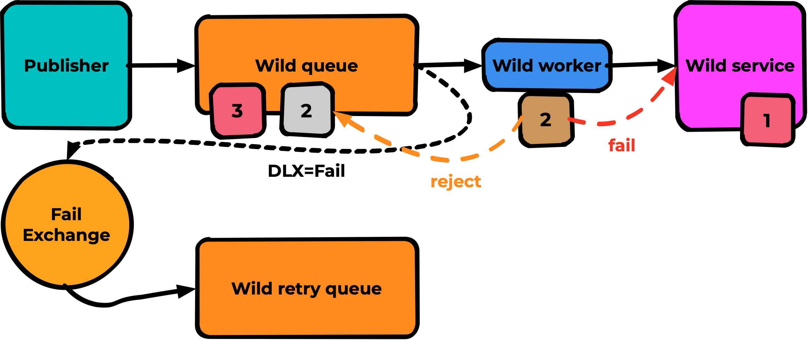

Принцип тот же, но работает проще - меньше кода, меньше возможных проблем. Результат ожидаемо аналогичный:

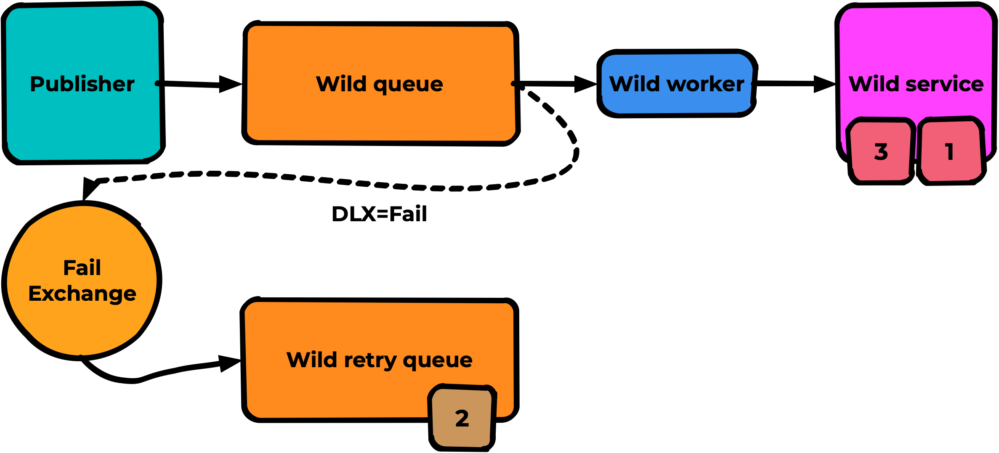

Но ведь нам нужно совершать повторные попытки обработки? А не просто складывать сообщения в отстойник. Для этого мы используем тот же самый механизм DLX + механизм TTL:

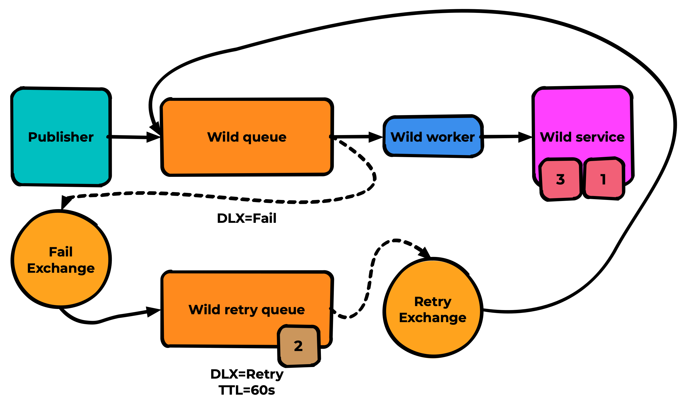

В результате сообщение 2 будет каждую минуту возвращаться в основную очередь, будет происходить попытка его обработки и так далее пока сообщение наконец не будет успешно обработано. Всё просто и без лишнего кода.

> Для очередей без consumer, где возможно хранение сообщений - рекомендую также добавлять признак lazy-queue чтобы RabbitMQ старался не держать эти сообщения в оперативке.
> 

Также, хочу обратить, ваше внимание на нейминг очередей. Очень важно сразу договориться, чтобы не разводить бардака на проекте. Названия очередей должны быть поняты всем на проекте, а всякие специализированные очереди (типа очередей с ттл и dlx или очередей-отстойников для сбойных сообщений/дублей) лучше называть с какими-либо суффиксами (например .dlx и .fail соответсвенно)

Крайне желательно, чтобы начало названия очереди совпадало с названием workload’а/контейнера - чтобы поиском можно было легко и просто найти worker, отвечающий за обработку этой очереди.

## Практика

Для дальнейшей работы нам понадобятся генератор сообщений и эмулятор консьюмера. Я их предварительно подготовил и разместил в этом же репозитории в папках generator и consumer

### Генератор сообщений

Код и докерфайлы для сборки лежат прямо в репозитории с этой документацией в папке **/generator**

Всё, что делает - создаёт поток сообщений в RabbitMQ с задержкой SLEEP, задаваемой через переменные окружения.

Остальные переменные окружения со значениями по умолчанию и описание работы можно посмотреть в файле **README.MD** в репозитории

### Эмулятор consumer

Код и докерфайлы для сборки лежат прямо в репозитории с этой документацией в папке **/consumer** - тут можно посмотреть код consumer и устройство автоматической сборки

Переменные окружения со значениями по умолчанию и описание работы можно посмотреть в файле **README.MD** в репозитории

Консьюмится на указанную очередь, однопоточно получает сообщения и выводит их в stdout. В случае указания переменной окружения FAIL = true - на половину сообщений делает reject(false) вместо ACK (полезно для проверки работы очереди повторных попыток)

Время обработки каждого сообщения также указывается в миллисекундах через переменную окружения SLEEP

## Registry
Здесь и далее я подразумеваю что вы собрали консьюмер и генератор и запушили в свой реджистри с именем **$REGISTRY**

Соответвенно они должны быть доступны по путям:

**REGISTRY/rabbitmq/consumer:main** и **REGISTRY/rabbitmq/generator:main**

Если у вас нет возможности использовать реджистри - можно настроить сборку прямо в папке окружения скопировав код и использовав примерно такой **docker-compose.yml**:

```yaml
version: "2"
services:
  gen:
    build:
      context: ./generator
    environment:
      ...

  consumer:
    build:
      context: ./consumer
    restart: always
    environment:
      ...
```

## Настраиваем pipeline publisher-consumer

Все как обычно, с docker-compose.yml из предыдущих уроков:

```yaml
version: "2"
services:
  rabbitmq:
    image: rabbitmq:3.10.7-management
    hostname: rabbitmq
    restart: always
    environment:
      RABBITMQ_DEFAULT_USER: rmuser
      RABBITMQ_DEFAULT_PASS: rmpassword
      RABBITMQ_SERVER_ADDITIONAL_ERL_ARGS: -rabbit disk_free_limit 2147483648
    volumes:
      - ./rabbitmq:/var/lib/rabbitmq
    ports: ["15672:15672"]
```

Удаляем старый стейт(если он есть) и стартуем чистый rabbitmq, проверяем что всё работает

```bash
docker-compose down
rm -rf ./rabbitmq
docker-compose up -d
```

Декларировать queue, exchange  и bindings мы не будем - пусть этим занимается consumer. Для этого добавим в docker-compose.yml этот контейнер:

```yaml
  consumer:
    image: $REGISTRY/rabbitmq/consumer:main
    restart: always
    environment:
      FROM_USERNAME: "rmuser"
      FROM_PASSWORD: "rmpassword"
      FROM_HOSTNAME: "rabbitmq"
      FROM_PORT: "5672"
      FAIL: "false"
      SLEEP: "100"
      FROM_QUEUE: "inbox"
      FROM_EXCHANGE: "in"
      FROM_ROUTINGKEY: "gen"
      FROM_PASSIVE: "false"
      PREFETCH: "1"
```

Если заглянуть в код или README репозитория consumer можно обратить внимание, что поля:

- FROM_USERNAME
- FROM_PASSWORD
- FROM_HOSTNAME
- FROM_PORT

имеют значения по умолчанию подходящие для нашего стенда - мы не будем в дальнейшем их указывать в docker-compose.yml. они могут вам пригодится, если вы захотите их подключить к каким-то другим rabbit с другими реквизитами доступа.

Также хочу обратить ваше внимание на переменные окружения:

**FROM_PASSIVE: "false"**

Если passive=false - consumer задекларирует отсутствующие сущности самостоятельно. То, что нам нужно в данном случае.

Если true - только проверит наличие необходимых сущностей и, в случае отсутствия, сообщит об ошибке и прекратит работу

**FROM_QUEUE: "inbox"**

Очередь, на которую произойдет консьюминг. Обязательная переменная
**FROM_EXCHANGE: "in"
FROM_ROUTINGKEY: "gen"**
Exchange и Routing Key - нужны для декларирования, если не указать - будет задекларирована только очередь. Не обязательные параметры.

В результате финальный docker-compose.yml с consumer должен получится примерно таким:

```yaml
version: "2"
services:
  consumer:
    image: $REGISTRY/rabbitmq/consumer:main
    restart: always
    environment:
      FAIL: "false"
      SLEEP: "100"
      FROM_QUEUE: "inbox"
      FROM_EXCHANGE: "in"
      FROM_ROUTINGKEY: "gen"
      FROM_PASSIVE: "false"
      PREFETCH: "1"

  rabbitmq:
    image: rabbitmq:3.10.7-management
    hostname: rabbitmq
    restart: always
    environment:
      RABBITMQ_DEFAULT_USER: rmuser
      RABBITMQ_DEFAULT_PASS: rmpassword
      RABBITMQ_SERVER_ADDITIONAL_ERL_ARGS: -rabbit disk_free_limit 2147483648
    volumes:
      - ./rabbitmq:/var/lib/rabbitmq
    ports: ["15672:15672"]
```

Запускаем consumer:

```bash
docker-compose up -d consumer
```

В результате в веб-интерфейсе rabbit мы должны увидеть, что у нас появится очередь “inbox”, exchange - “in” и  между ними с routing key - “gen”

> exchange типа direct - захардкожен в данном случае
> 

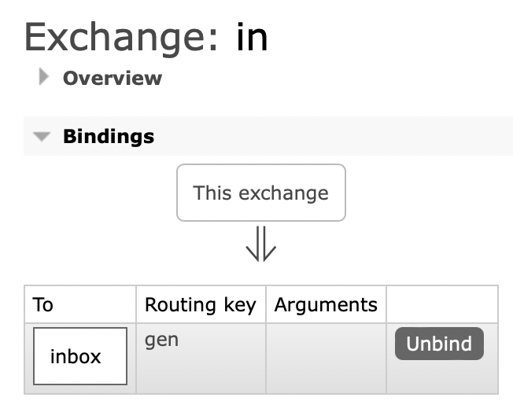

Можно попробовать отправить сообщение в exchange и проверить, что консьюмер его обработает и выдаст на stdout в логе его payload.


```bash
MacBookPro:stand4 kilex$ docker-compose logs -f --no-log-prefix consumer
Attaching to stand4_consumer_1
2022/10/12 06:18:50 FROM: got Connection, getting Channel
2022/10/12 06:18:50 FROM: declaring Queue (inbox)
2022/10/12 06:18:50 FROM: got Channel, declaring Exchange (in)
2022/10/12 06:18:50 FROM: binding Exchange (in) to Queue (inbox) with RoutingKey (gen)
2022/10/12 06:18:50 FROM: 0 messages in queue inbox
2022/10/12 06:18:50 Queue bound to Exchange, starting Consume (consumer tag '23646deb5057'), sleeping: 100 ms
2022/10/12 06:27:05 Message: test from web!, RoutingKey: gen
```

Ура, наш consumer работает.

Теперь давайте создадим ему нагрузку, для этого в наше окружение добавим генератор сообщений.

```yaml
gen:
    image: $REGISTRY/rabbitmq/generator:main
    environment:
      TO_EXCHANGE: "in"
      TO_ROUTINGKEY: "gen"
      TO_PASSIVE: "true"
      JOB_MODE: "false"
      SLEEP: "80"
      COUNT: "100000"
      REPORT: "100"
```

Тут хочу обратить ваше внимание на переменную окружения SLEEP - она меньше, чем в консьюмере, это значит,  что сообщения будут генерироваться быстрее, чем обрабатываться. Сделано специально, чтобы увидеть как растут очереди.

Финально наш docker-compose.yml должен получится примерно таким:

```yaml
version: "2"
services:

  consumer:
    image: $REGISTRY/rabbitmq/consumer:main
    restart: always
    environment:
      FAIL: "false"
      SLEEP: "100"
      FROM_QUEUE: "inbox"
      FROM_EXCHANGE: "in"
      FROM_ROUTINGKEY: "gen"
      FROM_PASSIVE: "false"
      PREFETCH: "1"

  gen:
    image: $REGISTRY/rabbitmq/generator:main
    environment:
      TO_EXCHANGE: "in"
      TO_ROUTINGKEY: "gen"
      TO_PASSIVE: "true"
      JOB_MODE: "false"
      SLEEP: "80"
      COUNT: "100000"
      REPORT: "100"

  rabbitmq:
    image: rabbitmq:3.10.7-management
    hostname: rabbitmq
    restart: always
    environment:
      RABBITMQ_DEFAULT_USER: rmuser
      RABBITMQ_DEFAULT_PASS: rmpassword
      RABBITMQ_SERVER_ADDITIONAL_ERL_ARGS: -rabbit disk_free_limit 2147483648
    volumes:
      - ./rabbitmq:/var/lib/rabbitmq
    ports: ["15672:15672"]
```

Запускаем генератор

```bash
docker-compose up -d gen
```

После чего открываем в веб-интерфейсе страницу нашей очереди, видим, как наваливает генератор и как не справляется consumer, как следствие очередь растёт(ожидаемо):


Один из вариантов расшивания такой проблемы - это ускорение работы consumer. Ну, например, мы там что-то подтюнили и он стал обрабатывать сообщение не за 100мс, а за 50.

```yaml
consumer:
    image: $REGISTRY/rabbitmq/consumer:main
    restart: always
    environment:
      FAIL: "false"
      SLEEP: "50"
      FROM_QUEUE: "inbox"
      FROM_EXCHANGE: "in"
      FROM_ROUTINGKEY: "gen"
      FROM_PASSIVE: "false"
      PREFETCH: "1"
```

Применяем, проверяем

```bash
docker-compose up -d consumer
```

Ожидаемо - очередь начала разгребаться:


Если же мы хотим увеличить кол-во обработчиков - можем сделать это командой: 

```bash
docker-compose scale consumer=3
```

Запустятся 3 инстанса и суммарно будут грести в три раза быстрее


В рабочем режиме очереди должны выглядеть как пустые, где скорость паблиша примерно равна скорости обработки:


По сути мы настроили частный случай pipeline обработки - на один шаг, где есть только publisher и consumer. в 90% проектов работа с rabbit выглядит именно так.

Выключим consumer и генератор, чтобы они нам пока не мешались

```bash
docker-compose stop gen consumer
```

## Очередь повторных попыток

Для реализации очереди повторных попыток нам необходимо создать дополнительную очередь. Назовём её к примеру “**inbox.retry.dlx**”.

Чтобы в очередь была маршрутизация создаём exchange с типом direct с названием, например “**fail**”

> (конечно лучше давать более полные названия, чтобы понять к какой очереди этот fail имеет отношение, но на стенде не будем париться)
> 

Добавляем binding в нашу очередь **inbox.retry.dlx** с routing key **gen** (мы не будем его менять):


Теперь нам нужно для очереди inbox добавить dead letter exchange ведущий в нашу очередь. Так как очередь уже существует - делаем это через policy:


Теперь можем проверить работу reject - создадим сообщение(через exchange, иначе routing key будет не подходящий):


И получим его с ackmode - reject false:


Сообщение должно отобразиться и исчезнуть из очереди **inbox**. Если мы всё сделали верно - сообщение должно появится в очереди **inbox.retry.dlx:**


Получим его, чтобы взглянуть на его содержимое:


Как мы видим, у сообщения появились заголовки, в которых отражаются все движения по dlx - откуда, когда и по какой причине. Полезно, этого не нужно реализовывать на стороне приложения.

Reject работает, теперь надо настроить автоматические повторы - возвращение сообщений из этой очереди в основную очередь для повторной обработки. Для этого создадим policy для **inbox.retry.dlx:**


**message-ttl = 15000** - значит, что сообщения в этой очереди будут жить только 15 секунд, после чего будут перемещены в dead-letter-exchange “**retry”** с Routing Key  “**retry**”

создадим этот exchange **retry** и прибиндим нашу базовую очередь **inbox** c routing key **retry**. 


Также так как мы меняем routing key для первой повторной попытки, чтобы нормально работали дальнейшие попытки надо добавить binding с Routing Key **retry** из exchange **fail** в очередь **inbox.retry.dlx**


Теперь всё должно заработать. Пробуем отправить сообщение через exchange **in** с routing key **gen**, делаем ему **reject(false)** в очереди **inbox**, наблюдаем его 15 секунд в очереди **inbox.retry.dlx**, затем видим его снова в очереди **inbox.** Посмотрим на его содержимое в результате чтобы удостовериться, что всё прошло верно:


> Стоит прогнать одно и тоже сообщение несколько раз, чтобы убедится, что не только первая попытка обрабатывается успешно, но и остальные (тк у них сменится routing key)
> 

Теперь давайте воспользуемся опцией тестового consumer “FAIL”, которая будет делать reject половине сообщений.

```yaml
consumer:
    image: $REGISTRY/rabbitmq/consumer:main
    restart: always
    environment:
      FAIL: "true"
      SLEEP: "100"
      FROM_QUEUE: "inbox"
      FROM_EXCHANGE: "in"
      FROM_ROUTINGKEY: "gen"
      FROM_PASSIVE: "false"
      PREFETCH: "1"
```

применим изменения

```bash
docker-compose up -d consumer
```

Запустим генератор и заскейлим количество consumer до 3. В результате, основная очередь будет успевать разгребаться, но очередь повторных попыток подрастёт


```bash
docker-compose up -d gen
docker-compose scale consumer=3
```

Подождем некоторое время, остановим генератор. Сообщения из очереди повторных попыток могут разгребаться еще несколько минут. Это корректное поведение.


можем проверить по логам, что последнее время consumer обрабатывал только повторные попытки (с RoutingKey **retry**)

```bash
docker-compose logs -f --no-log-prefix consumer
```

