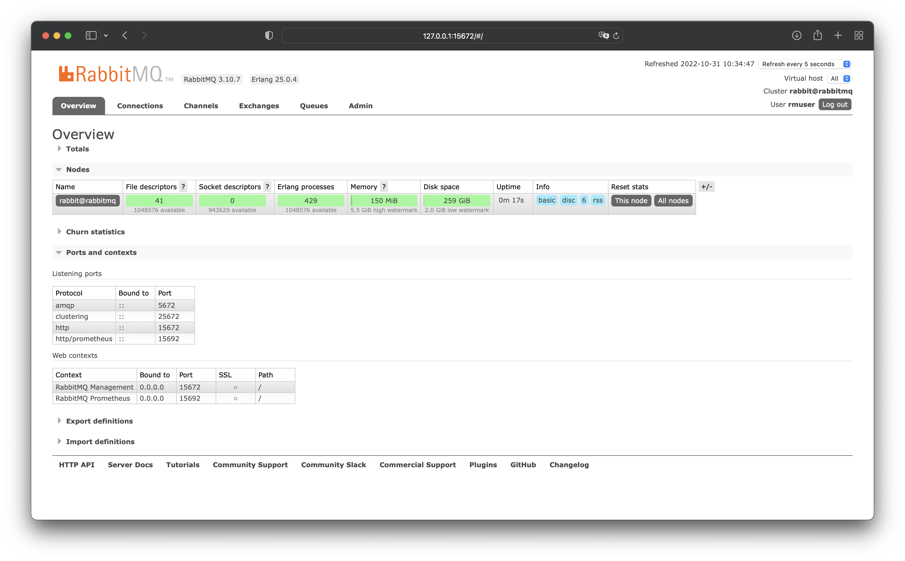
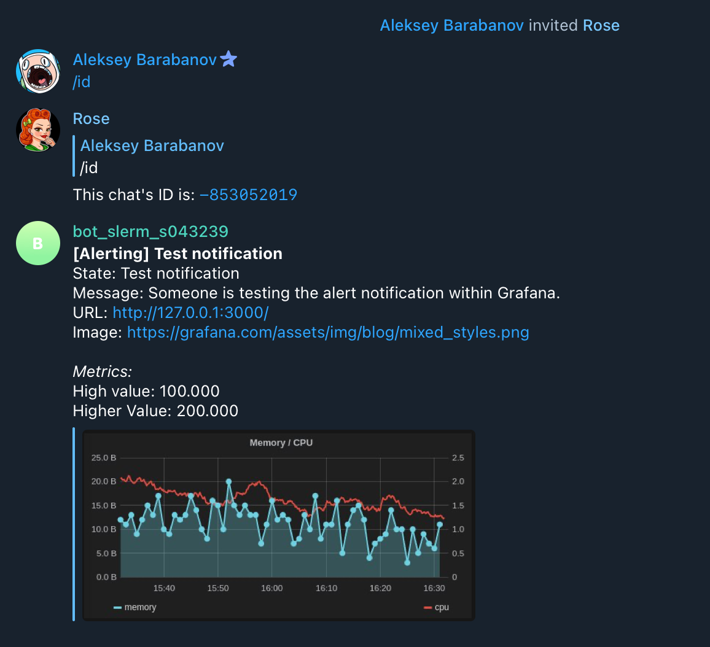

# Мониторинг

## Введение

В этом уроке речь пойдёт об аспектах мониторинга сервиса RabbitMQ. Мы рассмотрим базовые возможности конфигурирования логирования сервиса, различные экспортеры метрик, узнаем о полезных метриках и настроим мониторинг некоторых метрик через prometheus-стек.

- Логирование
- Мониторинг
- Встроенный prometheus-exporter
- Внешний prometheus-exporter - telegraf
- Полезные метрики
- Настройка стека мониторинга

## Логирование

В docker - используется обычный вывод на stdout, поэтому если вы захотите изменить настройки в работе логирования нужно руководствоваться именно опциями log.console.

Если вы будете использовать встроенный механизм логирования - log.file, то можно будет настроить ротацию логов по различным признакам. Как по мне, это совсем не докервей - отдавать работу с логами в сервис, поэтому не будем заострять на этом внимание.

### Уровни логирования

От самого подробного уровня к самому молчаливому:

- **debug:** самое детальное логирование, на продакшен инсталяциях не стоит оставлять такой параметр надолго - может быстро скушать всё место на сервере
- **info:** средний уровень логирования, по умолчанию - то, что вы видели когда заходили в логи сервиса без особых настроек. Вполне приемлемый уровень
- **warning:** тут уже 99% времени мы наблюдаем тишину в логе, логи будут только по предупреждениям, ошибкам и фаталам
- **error:** только ошибки и фаталы
- **critical:** только фатальные уведомления
- **none:** в логе будет только стартовая плашка запуска rabbit, дальше тишина

### Категории логирования

Отдельно уровни логирования можно настроить по категориям 

- **connection:** всё, что связано с соединениями всех протоколов
- **channel:** логи каналов - только для AMQP
- **queue:** логи событий, связанных с очередями
- **mirroring:** логи событий репликации классических очередей в кластере
- **federation:** логи федерации
- **upgrade:** логирование процедуры апгрейда
- **default:** общая категория для всех типов событий

### Логирование в JSON

Логгер можно настроить на логирование в JSON - удобно для дальнейшего автоматического разбора. Для этого в примонтированый в папку `/etc/rabbitmq/conf.d/` файл конфига необходимо добавить строку:

```yaml
log.console.formatter = json
```

### Изменение уровня “на лету”

Для того, чтобы без перезагрузки изменить уровень логирования можно запустить такую команду в контейнере rabbit. Указать конкретные каналы логирования не получится - уровень меняется только глобально (в данном случае уровень логирования станет “debug”)

```bash
rabbitmqctl set_log_level debug
```

В предыдущих уроках я рассказывал, как изменить уровень логирования при помощи переменной окружения - оказывается что такой механизм не работает с версии 3.8. `RABBITMQ_SERVER_ADDITIONAL_ERL_ARGS: -rabbit log_levels [{connection,error},{default,error}]` - **не работает с 3.8!**

Для полноценный настройки логирования нужно примонтировать файл с наcтройками в папку `/etc/rabbitmq/conf.d`

```bash
log.console.level = debug
```

Если мы хотим debug+json:

```bash
log.console.level = debug
log.console.formatter = json
```

Вообще детально почитать про логирование, уровни, категории и специфику настройки вы всегда можете в [официальной документации](https://www.rabbitmq.com/logging.html).

## Мониторинг

Самое важное - мониторинг нужен всем, без него мы слепы. Без него можно обойтись разве что в локальной разработке - даже в дев/стедж окружениях он необходим, чтобы как минимум проверять систему при изменениях, как максимум - для нагрузочных тестов.

Есть множество стеков мониторинга, не моё дело навязывать вам какой-то конкретный. Для некоторых задач лучше подходит один стек, для других задач - другой. У сервисов с большой историей бывают просто сложившиеся стеки. В рамках этого урока я буду использовать именно стек с prometheus, так как, на мой взгляд, для этих задач он подходит лучше всего.

Важная часть мониторинга - это уведомления о превышении каких-либо порогов. Недоступность сервиса, мало места на диске, кончилась оперативка - об этих событиях нужно знать как можно раньше, поэтому я настоятельно рекомендую уведомлять в мессенджерах, а никак не почтой или процедурой “зашел посмотрел что не так”. Мы в наших сервисах, например таких, как рабочий мессенджер, используем телеграмм, поэтому уведомления мне привычно получать в общих чатах от бота. Чтобы все видели уведомления, чтобы можно было обсудить проблему прямо “на месте”, чтобы было понятно, что проблемой кто-то занялся.

### Метрики

Что же мы мониторим?

Конечно же, это основные метрики оборудования (железки/виртуальной машины).Это память, место на диске, утилизация процессора и сетевых интерфейсов. Также метрики связанные с работоспособностью сервиса - это связность, доступность порта.

А вот внутренние метрики - это уже непосредственно свойство Rabbit и тут надо пройтись подробнее.

У Rabbit есть встроенный экспортер для prometheus, который я, к сожалению, не могу рекомендовать, как основной ввиду отсутствия некоторых полезных данных. Я рекомендую попробовать внешний экспортер - [telegraf](https://www.influxdata.com/time-series-platform/telegraf/), о нем мы подробнее поговорим дальше.

Есть конечно и другие экспортеры - вы можете поискать и попробовать их, возможно вам что-то подойдет лучше, чем встроенный или telegraf. Но пока из того, что я пробовал - не понравилось ничего кроме телеграфа.

### Алертинг

На что нужно настраивать уведомления?

Конечно же, на недоступность узлов кластера (ну или одного инстанса rabbit, если у нас не кластер) - как проверка связности по ICMP - так и проверка доступности порта amqp. Самый базовый алерт для любого сервиса, не только RabbitMQ.

Дальше уже специализированная для RabbitMQ метрика - длина очередей. В идеальной системе все очереди должны быть пустыми. Возможно, под большой нагрузкой будут какие-то скачки в ЧНН (часы наибольшей нагрузки), но они должны нести временный характер. поэтому мы настраиваем уведомление на длину очереди. Пороговые значения необходимо подбирать сугубо индивидуально. На некоторых сервисах у меня порог - свыше 1000 сообщений, на низконагруженных даже порог в 10 сообщений может быть достигнут слишком поздно. Также не забываем о очередях c DLX и TTL - где нет consumer`s и нахождение сообщений там - норма. Если мы сразу продумали их нейминг - ловким движением настройки системы мониторинга мы исключим их из алертинга.

Как по мне, длина очередей - одна из важнейших метрик мониторинга RabbitMQ. 99% текущих проблем сервиса решаются этой метрикой и этим уведомлением. Но есть и другие важные метрики.

Отсутствие consumer`s на очередях - полезная метрика особенно на малонагруженных очередях, где даже 10 сообщений в очереди может откладываться несколько часов. Помогает понять, что очередь никто не консьюмит до того, как придет уведомление о большой длине очереди.

Также полезная метрика на рост количества ределиверов - обычно обозначает или проблемы с каким-то конкретным сообщением, которое мешает прохождению остальных сообщений, или проблемы с другими сервисами, к которым обращается consumer этой очереди при обработке.

Пересоздание каналов, соединений - метрика полезная, при количестве пересозданий каналов 300+ у rabbit уже начинаются проблемы и надо втыкать amqproxy. Даже если у вас сейчас всё хорошо - стоит это мониторить на случай, когда из-за какой-то ошибки в релизе или просто неумелом написании сервиса количество пересозданий соединений внезапно возрастет.

Настройка порога свободного места, его срабатывание - та самая метрика, про которую я говорил с ранних уроков - недопустимость работы на кончающемся свободном месте. Можем замониторить как наличие этой опции (чтобы внезапно она не переключилась в значение по умолчанию из-за ошибки конфигурации или очередном обновлении, где они опцию из переменных окружения объявят деприкейтед. Также полезно знать о факте срабатывания этого порога - значит, что rabbit уже не работает и надо срочно бежать решать эту проблему.

Ну и пороги на память, место, утилизацию процессора и сетевых интерфейсов - это просто необходимость для любых сервисов размещающихся на виртуалках или железных серверах.

## Встроенный экспортер

Переходим к встроенному экспортеру в prometheus.

Из плюсов - работает нативно, “из коробки”. В последних версиях включен по умолчанию, дополнительных действий не требуется, если вы не переопределяете `enabled_plugins` - тогда надо указывать его явно (как и менеджмент плагин, например)

Экспортер слушает на порту **15692**

Метрики доступны по двум URL:

- **http://127.0.0.1:15692/metrics**
**Общие метрики** - тут только суммарные скорости, количество сообщений consumer`s и так далее - без разбивки по конкретным queue/exchange.
- **http://127.0.0.1:15692/metrics/per-object**
**“по объектам”** - на этом url уже метрики более детально разбитые по сущностям.

Встроеный экспортер не умеет в счётчики publish, доставки, ределиверов. Мы можем замониторить длину очереди, количество consumer`s, но вот со счетчиками событий уже будут сложности.

Нужно ходить во все узлы кластера - потому что о статусе той или иной очереди отчитывается только мастер этой очереди. Ничего плохого в этом нет, но нужно иметь это ввиду при планировании архитектуры мониторинга.

Также встроенный экспортер содержит много внутренних метрик процессов erlang и прочей служебной информации мало понятной и мало полезной при штатной эксплуатации rabbit не на грани его возможностей. Этого не даст никакой внешний экспортер.

### Настройка

Чтобы включить встроенный экспортер нужно или

- не монтировать вообще файл `enabled_plugins` - так как плагин в последних версиях включен по умолчанию
- или добавить `rabitmq_prometheus` в список плагинов если мы указываем их явно

```bash
[rabbitmq_prometheus,rabbitmq_management].
```

Далее чтобы посмотреть на метрики открываем порт **15692** - этого не нужно делать если prometheus находится в одном окружении с rabbit, но чтобы посмотреть список метрик, например, в браузере - придётся его открыть.

```yaml
rabbitmq:
    image: rabbitmq:3.10.7-management
    hostname: rabbitmq
    restart: always
    environment:
      RABBITMQ_DEFAULT_USER: rmuser
      RABBITMQ_DEFAULT_PASS: rmpassword
      RABBITMQ_SERVER_ADDITIONAL_ERL_ARGS: -rabbit disk_free_limit 2147483648
    volumes:
      - ./rabbitmq:/var/lib/rabbitmq
      - ./enabled_plugins:/etc/rabbitmq/enabled_plugins
    ports:
      - 15672:15672
      - 15692:15692
```

### Полезные метрики

Применяем изменения, открываем локейшен `/metrics`. Там будет много всякого, но я хочу обратить ваше внимание на полезные метрики (на мой взгляд).

`rabbitmq_alarms_free_disk_space_watermark 0` - по сути триггер срабатывания алерта на свободное место - 0 все хорошо, 1 все плохо

`rabbitmq_disk_space_available_limit_bytes 2147483648` - как раз настройка алерта, гигабит в данном случае.

```yaml
rabbitmq_connections_opened_total 1
rabbitmq_connections_closed_total 1
rabbitmq_channels_opened_total 1
rabbitmq_channels_closed_total 1
rabbitmq_queues_declared_total 1
```

блок из счетчиков открытых/закрытых коннектов, каналов и счетчик передекларирования очередей

```yaml
erlang_vm_dist_recv_bytes{peer="rabbit@rabbitmq2"} 784631
erlang_vm_dist_recv_bytes{peer="rabbit@rabbitmq3"} 914168
erlang_vm_dist_send_bytes{peer="rabbit@rabbitmq2"} 371742
erlang_vm_dist_send_bytes{peer="rabbit@rabbitmq3"} 421456
```

эти строки будут полезны владельцам нагруженных кластеров - показывают трафик в обе стороны до остальных нод кластера. Из-за специфики работы кластеризации стоит присматривать за этими показателями.

Ну, а на локейшене `/metrics/per-object` из полезного я нашел только метрики текущей длины очереди и количества подключенных consumer`s:

```yaml
rabbitmq_queue_messages{vhost="/",queue="test1"} 1
rabbitmq_queue_consumers{vhost="/",queue="test1"} 0
```

## Внешний exporter - telegraf

Перейдём к внешнему экспортеру - telegraf. 

- [Оф. сайт](https://www.influxdata.com/time-series-platform/telegraf/)
- [github repo](https://github.com/influxdata/telegraf)
- [github список input плагинов](https://github.com/influxdata/telegraf/tree/master/plugins/inputs)

Это легковесный сервис на Golang (мало весит, кушает совсем немного ресурсов)

Он поддерживает мониторинг множества других сервисов, подробнее со списком можно ознакомиться или на сайте инфлюкса (это их творение) или на гитхаб репе проекта (мне показалось более удобным смотреть примеры на гитхабе). В результате можно замониторить все окружение целиком только при помощи одного телеграфа - и связность и открытость портов и свежесть сертификатов https и mysql и RabbitMQ и redis… и что угодно)

Почитать примеры настройки можно выбрав интересующий плагин [из списка](https://github.com/influxdata/telegraf/tree/master/plugins/inputs), например [rabbitmq](https://github.com/influxdata/telegraf/tree/master/plugins/inputs/rabbitmq)

В отличие от встроенного экспортера rabbit умеет в счетчики publish, доставки, ределиверов. В принципе он дает доступ ко всем данным, какие только можно увидеть в веб-интерфейсе RabbitMQ.

Он работает с кластером, как с единым целым и, в принципе, его можно подключить только к одной ноде (ну или к любой - через балансер) но нет ничего сложного в том, чтобы настроить его на мониторинг всех нод одновременно.

Работает он через RestAPI - через порт менеджмента 15672, имейте это ввиду при настройке.

### Настройка

Для того чтобы добавить сервис telegraf в наше окружение в docker-compose.yml добавим такой сервис.

```yaml
telegraf:
    image: telegraf:latest
    hostname: telegraf-slerm
    restart: always
    volumes:
      - ./telegraf.conf:/etc/telegraf/telegraf.conf
    ports:
      - 9126:9126
    links:
      - rabbitmq
```

Порт 9126 - это порт экспортера для prometheus. Стейт сервису не нужен. Линк нужно настроить, чтобы в случае пересоздании контейнера telegraf не потерял связи с RabbitMQ. Если мы работаем с кластером, то в линках стоит перечислить все узлы. Настройка происходит через файл конфигурации `/etc/telegraf/telegraf.conf`

```bash
[global_tags]
[agent]
  interval = "10s"
  round_interval = true
[[outputs.prometheus_client]]
  listen = ":9126"
  expiration_interval = "60s"
[[inputs.rabbitmq]]
  url = "http://rabbitmq:15672"
  username = "rmuser"
  password = "rmpassword"
```

Вот его содержимое. Возможных опций сильно больше, но я убрал все ненужное. И так будет нормально работать.

В частности нас интересуют блоки:

`outputs.prometheus_client` - настройка экспортера для prometheus (да он умеет не только в prometheus, но и в кучу других TimeSeries баз данных)

`inputs.rabbitmq` - как раз получение метрик из rabbit, тут указываем url до менеджмента (не AMQP!) и данные авторизации.

В случае с кластером, если мы хотим мониторить все ноды (хотя это не обязательно) просто дублируем input`s с RabbitMQ:

```bash
[[inputs.rabbitmq]]
  url = "http://rabbitmq1:15672"
  username = "rmuser"
  password = "rmpassword"
[[inputs.rabbitmq]]
  url = "http://rabbitmq2:15672"
  username = "rmuser"
  password = "rmpassword"
[[inputs.rabbitmq]]
  url = "http://rabbitmq3:15672"
  username = "rmuser"
  password = "rmpassword"
```

### Полезные метрики

После запуска телеграфа, если открыть его `/metrics` там будет много всего, но из важного я бы хотел обратить ваше внимание на

`rabbitmq_node_disk_free_alarm` - статус alarm для свободного места всех нод в кластере (еще раз повторюсь - для получения этих данных не обязательно подключаться ко всем узлам кластера - можно получить данные с любого)

`rabbitmq_node_disk_free_limit` - настроенный лимит порога свободного места всех нод в кластере

`rabbitmq_node_uptime` - аптайм всех нод в кластере - можно мониторить перезагрузки

`rabbitmq_node_running` - статус нод в кластере

`rabbitmq_queue_slave_nodes` - количество слейвов для каждой классической очереди

`rabbitmq_queue_synchronised_slave_nodes` - количество синхронизированных слейвов для каждой классической очереди - данные могут быть полезны если у вас настроена не автоматическая синхронизация реплик, а ручная

Ну и метрики по конкретным сущностям:

`rabbitmq_exchange_messages_publish_in` - счетчик входящих для каждого exchange

`rabbitmq_exchange_messages_publish_out` - счетчик исходящих для каждого exchange

`rabbitmq_queue_consumers` - кол-во consumer`s для каждой очереди

`rabbitmq_queue_messages` - кол-во сообщений для каждой очереди

`rabbitmq_queue_messages_ack` - счетчик ACK для каждой очереди

`rabbitmq_queue_messages_redeliver` - счетчик ределиверов для каждой очереди

`rabbitmq_queue_messages_deliver_get` - счетчик деливеров для каждой очереди

`rabbitmq_queue_messages_publish` - счетчик publish для каждой очереди

ну и многое другое - просто откройте полный список и ищите интересующие показатели

## Стек

По сути стек мониторинга кластера RabbitMQ выглядит примерно так:


Телеграфом мы забираем метрики или с одной ноды или со всех узлов кластера (или через балансер с одной ноды)

Затем prometheus забирает метрики уже из телеграфа, складирует в хранилище

Grafana мы подключаем к prometheus для отображения графиков и отправки уведомлений в телеграм.

Для окружений без кластера картинка выгляди попроще:


### Поднимаем RabbitMQ

Дальше давайте перейдем к описанию полной настройки этого стека.

Для начала поднимаем один инстанс rabbitmq (все настройки для кластера аналогичные)

```yaml
rabbitmq:
    image: rabbitmq:3.10.7-management
    hostname: rabbitmq
    restart: always
    environment:
      RABBITMQ_DEFAULT_USER: rmuser
      RABBITMQ_DEFAULT_PASS: rmpassword
      RABBITMQ_SERVER_ADDITIONAL_ERL_ARGS: -rabbit disk_free_limit 2147483648
    volumes:
      - ./rabbitmq:/var/lib/rabbitmq
      - ./enabled_plugins:/etc/rabbitmq/enabled_plugins
      - ./formatter.conf:/etc/rabbitmq/conf.d/formatter.conf
    ports:
      - 15672:15672
      - 15692:15692
```

Примонтируем файлы `enabled_plugins` и `formatter.conf` - для активации встроенного prometheus exporter и увеличения уровня логирования (! не обязательно, просто опыта ради)

Содержимое `enabled_plugins` :

```bash
[rabbitmq_prometheus,rabbitmq_management].
```

Содержимое `formatter.conf` :

```bash
log.console.level = debug
```

Ну и откроем порт 15692 - встроенный экспортер - только если вам интересно посмотреть его метрики. В настройке стенда эти данные использоваться не будут.

Запустим rabbitmq, проверим что плагин встроенного экспортера активен:



Заодно создадим пару тестовых очередей, накидаем в них сообщений, чтобы проверить работу мониторинга:


Можно открыть в браузере список метрик в prometheus формате 

- [http://127.0.0.1:15692/metrics/per-object](http://127.0.0.1:15692/metrics/per-object)
- [http://127.0.0.1:15692/metrics](http://127.0.0.1:15692/metrics)


### Telegraf

Дальше давайте подключим telegraf:

```yaml
telegraf:
    image: telegraf:latest
    hostname: telegraf-slerm
    restart: always
    volumes:
      - ./telegraf.conf:/etc/telegraf/telegraf.conf
    ports:
      - 9126:9126
    links:
      - rabbitmq
```

Конфиг `telegraf.conf`:

```yaml
[global_tags]
[agent]
  interval = "10s"
  round_interval = true
[[outputs.prometheus_client]]
  listen = ":9126"
  expiration_interval = "60s"
[[inputs.rabbitmq]]
  url = "http://rabbitmq:15672"
  username = "rmuser"
  password = "rmpassword"
```

Запустим его, откроем его метрики в браузере [http://127.0.0.1:9126/metrics](http://127.0.0.1:9126/metrics):


### Prometheus

Вот с этими данными мы и будем работать. Поднимем prometheus, настроим его на получение данных из этого telegraf.

```yaml
prometheus:
    image: prom/prometheus:v2.39.1
    restart: always
    ports:
      - 9090:9090
    environment:
      TZ: Europe/Samara
    volumes:
      - ./prometheus.yml:/etc/prometheus/prometheus.yml
      - ./prometheus:/prometheus/data
    links:
      - telegraf
```

Содержимое prometheus.yml:

```yaml
global:
  scrape_interval: 10s
scrape_configs:
  - job_name: 'telegraf'
    scrape_interval: 10s
    static_configs:
      - targets: ['telegraf:9126']
```

> Тут мы настраиваем выборку раз в 10 секунд, что довольно избыточно в большинстве случаев, но для стенда так будет удобнее, оперативнее
> 

Запускаем prometheus, открываем его веб-интерфейс [http://127.0.0.1:9090](http://127.0.0.1:9090/)


В поле expression вводим интересующую нас метрику, например `rabbitmq_queue_messages`


### Grafana

Данные есть, prometheus работает. Теперь подключаем grafana

```yaml
grafana:
    image: grafana/grafana:7.5.17
    restart: always
    environment:
      TZ: Europe/Samara
      GF_SERVER_ROOT_URL: http://127.0.0.1:3000
    ports:
    - 3000:3000
    volumes:
    - ./grafana:/var/lib/grafana
    links:
      - prometheus
```

> Если вы будете запускать в другом месте - параметр `GF_SERVER_ROOT_URL` должен соотвеnствовать URL по которому вы будете открывать веб интерфейс - например http://grafana.youdomain.com
> 

> Версия grafana намерено старая - там упрощеная система алертинга. Разобравшись с ней дальше будет проще настроить новую систему.
> 

После запуска остальные настройки осуществляются через веб-интерфейс на порту 3000. Открываем [http://127.0.0.1:3000/](http://127.0.0.1:3000/?orgId=1), логин/пароль по умолчанию - admin/admin, интерфейс предложит вам сменить пароль сразу. Для стенда - не обязательно, для прода - конечно же меняем)


Заходим в Configuration → Data Sources


Тут нам надо добавить новый data source


Нас интересует именно Prometheus


Заполняем только два поля

- URL = **http://prometheus:9090**
- Scrape interval = **10s**


Внизу нажимаем кнопку Save & Test. Мы должны увидеть зеленое уведомление “**Data source is working”**


На этом подключение prometheus закончено. Давайте создадим дашборд для графиков Dashboards → Manage


Можно импотировать готовый дашборд с сайта grafana Dashboards → Manage → Import (6444)


Но его качество и информативность оставляет желать лучшего:


Поэтому лучше настроим свой дашборд

Dashboards → Manage → New Dashboard


Создадим новый график “Add an empty panel”


В поле Metrics - пишем выражение

```yaml
max(rabbitmq_queue_messages) by (queue,url)
```

В самом деле так как мы мониторим только один инстанс rabbit - можно группировать только до очереди (queue)

```yaml
max(rabbitmq_queue_messages) by (queue)
```

Чтобы улучшить читаемость легенды - в поле legend пишем

```yaml
{{ queue }}
```


Ну и для большего визуального удобства изменим настройки Legend


Применим, создадим еще один график - на количество consumers:

```yaml
max(rabbitmq_queue_consumers) by (queue)
```


Сохраним нам Dashboard:


Теперь давайте займемся уведомлениями. Для этого нам нужно

- Зарегистрировать telegram бота (узнать Token бота)
- Создать с ним чат (не написать ему в личку, а создать чат, где участники только вы и бот)
- Узнать id чата
- Настроить канал уведомлений в Grafana

### Регистрация бота

Открываем телеграм, поиском ищем “отца всех ботов” [https://t.me/BotFather](https://t.me/BotFather)


Нас с ним ждёт примерно такой диалог:


Важно что username у бота должен обязательно заканчиваться на `bot`

В результате вы получите токен бота, примерно такого плана, конечно же у каждого свой

```yaml
5791913252:AAEEi-7w76Th3ifi1SFf5M4ilFTP-IfAqF0
```

Теперь необходимо создать чат на двоих с этим ботом. Думаю с этим трудностей не возникнет.

Дальше чтобы узнать id чата проще всего добавить в чат еще одного бота - Rose [https://t.me/MissRose_bot](https://t.me/MissRose_bot) и отправить в чат служебную команду /id - затем бота Rose нужно исключить из чата.

Отлично, теперь у нас есть токен и ид чата. Возвращаемся в grafana. Alerting → Notification channels → Add channel


Вводим наш токен, ид чата. Также в дополнительных опциях для прод инсталяций я рекомендую настроить Send remainders - чтобы бот продолжал отправлять уведомления если проблема не будет решена:


Нажимаем внизу кнопку Test

В результате в чате мы увидим такое сообщение:



Значит канал уведомлений настроен корректно, переходим к настройке алертов. Возвращаемся в наш dashboard “RabbitMQ” и открываем редактирование графика с количеством сообщений, под графиком видим вкладку Alert - она то нам и нужна


Создаём алерт с такими параметрами:


По сути уведомлять когда количество сообщений в очереди станет больше 5. Не забываем настроить Send to на наш канал уведомлений, нажимаем Apply, затем Save - сохраняем dashboard.

В заголовке графика появится сердечко, ему потребуется некоторое время, чтобы обнаружить, что у нас есть проблемные очереди и в результате через ~ минуту мы должны получить уведомление в телеграм:


Если у вас в очередях было недостаточное количество сообщений - можете добавить их через веб интерфейс RabbitMQ, дождаться уведомления. 

Давайте почистим очереди, чтобы проверить приход уведомления о том, что всё в порядке:


В принципе, этих вещей достаточно, чтобы построить любой мониторинг и алертинг интересующих вас сущностей.

### Графики в сообщениях

Из коробки Grafana не присылает графики в сообщения, ей необходим модуль renderer. С некоторых пор он стал отдельным сервисом. Для того чтобы добавить отображение графиков настройка Grafana и рендерера должна выглядеть так:

```yaml
grafana:
    image: grafana/grafana:7.5.17
    restart: always
    environment:
      TZ: Europe/Samara
      GF_SERVER_ROOT_URL: http://127.0.0.1:3000
      GF_RENDERING_SERVER_URL: http://renderer:8081/render
      GF_RENDERING_CALLBACK_URL: http://grafana:3000/
    ports:
    - 3000:3000
    volumes:
    - ./grafana:/var/lib/grafana
    links:
      - prometheus
      - renderer

  renderer:
    restart: always
    image: hferreira/grafana-image-renderer:latest
    environment:
      TZ: Europe/Samara
```

`hferreira/grafana-image-renderer:latest` - это кастомная сборка рендерера, поддерживающая arm архитектуру, если у вас интел - вполне можно использовать штатный образ от grafana `grafana/grafana-image-renderer`