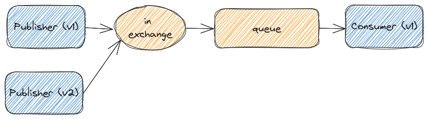
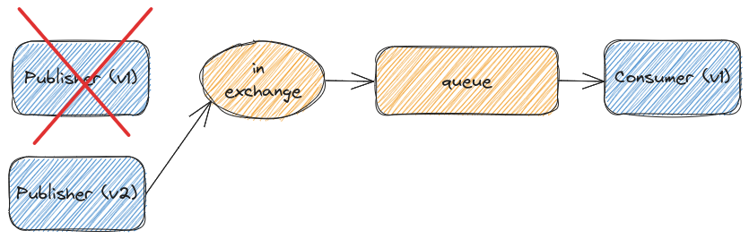
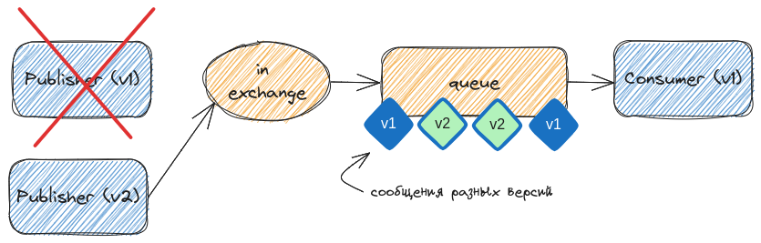
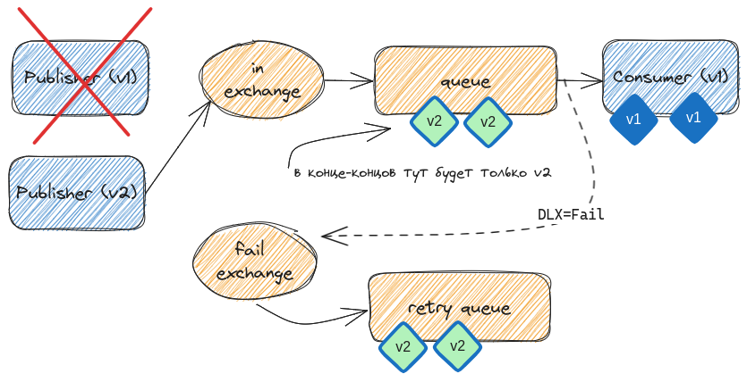
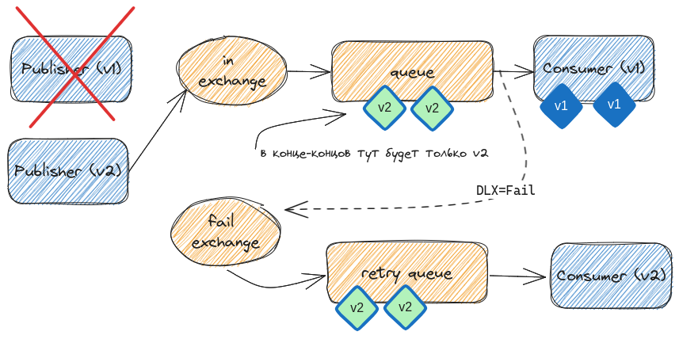

# Дополнительные возможности

## Введение

В этом уроке речь пойдёт о различных узкоспециализированных возможностях и кейсах использования RabbitMQ. Эти вещи будут полезны далеко не всем, но в некоторых случаях могут сэкономить много времени.

- **Расчет количества консьюмеров** - по формуле Эрланга
- **Шардирование** - различные способы балансировки
- **Дедупликация** сообщений в очереди
- **Многоуровневая очередь** повторных попыток
- **Приоритеты** сообщений

## Расчет количества консьюмеров

### Немного истории

**Агнер Краруп Эрланг 1878-1929**

**Агнер Краруп Эрланг** – сотрудник датской телефонной компании.

Он проводил анализ работы местной телефонной станции одной деревни, жители которой совершали вызовы абонентам других населённых пунктов. На основании этих работ он и стал основоположником теории массового обслуживания. Поработав с телекоме довольно длительное время начинаешь понимать что массовое обслуживание это не только call-центры но и любые другие потоки обработки данных, не обязательно с применением живых операторов. В системах коллцентров также используются очереди, распределение нагрузки - так же как и в высоконагруженных ит системах. Кстати в серъезных колцентрах очереди RabbitMQ не подходят потому что они слишком статичны.

Также хочу обратить ваше внимание что язык на котором написал RabbitMQ - называется Erlang, это язык созданный в первую очередь для разработки телекоммуникационных приложений. Есть две версии этимологии названия этого языка - или в честь Агнера Эрланга или просто сокращение от **Er**isson **lang**uage. Теперь уже никто и не вспомнит.

### Формула

В 1917 году он изобрел формулу, получившую название «формула Эрланга» - до сих пор активно используемую в телекоме.

Тут вы видите конкретно формулу Erlang-C - для расчета количества операторов для обеспечения требуемого уровня SLA.

Эта формула великолепно подходит для расчета количества консьюмеров, необходимых для обработки определенного количества сообщений в момент времени. Формула может пригодится когда обработка ваших сообщений занимает больше секунды - когда нужно спланировать мощности под размещение консьюмеров.

В принципе ее можно адаптировать и для расчета более быстрых консьюмеров. Но все текущие реализации этой формулы - имеют шаг в одну секунду.

Понятное дело что в таком виде использовать ее сложно. Есть масса онлайн калькуляторов Erlang-C, стоит только загуглить.

Но все эти калькуляторы сильно заточены именно под использование коллцентрами, в частности далеко не во всех можно указать время обработки меньше 5 секунд.

### Реализация

Поэтому на php и apache2 я сделал простейшую реализацию библиотеки erlang-c. Почему не на Golang - потому что это я делал лет 10 назад, переписывать просто лень.

Реализацию я выложил в этот репозиторий в папку **/erlang-c**

Там есть все необходимые для сборки и запуска файлы. Веб морда выглядит предельно аскетично.

Вверху вводим количество обрабатываемых сообщений за интервал, затем длину этого интервала.

Максимальная длина очереди говорит о том сколько сообщений допустимо держать в очереди до их взятия в обработку.

Время обработки - как раз среднее время сколько может занять обработка одного сообщения.

В конце уже идут два параметра SLA - это время ожидания каждого сообщения до начала обработки и SLA - процент сколько из всех сообщений уложатся в это время.

Затем нажимаем Calculate и получаем необходимое количество consumer’ов.

## Шардирование

Шардирование это по сути балансировка одного потока сообщений по очередям или инстансам RabbitMQ с применением (или без применения) ключа шардирования.

Использование ключа шардирования необходимо в случаях когда необходимо чтобы все сообщения с одним ключем попадали в одну очередь

Плагины:

- **consistent-hash**, позволяющий шардировать по консистентному кругу шардирования
- **modulus-hash** - с более простым и быстрым шардированием - по целочисленному делению
- **random** - ****без использования ключа шардирования, просто рандомное распределение

Также можно настроить шардирование (но уже без ключа, просто рандомом) при помощи shovel. Теперь давайте поподробнее о каждой методике

### consistent-hash

Шардирование по консистентному хешу - я не думаю что в рамках этого урока есть смысл объяснять его принципы, можете просто загуглить consistent hashing - вылезет много картинок с кругами. Если вкратце - этот механизм шардирования обеспечивает максимально высокий процент попадания одних и тех же ключей в свои шарды при изменении количества узлов шардирования. Это бывает полезно когда вам нужно чтобы сообщения с одним и тем же признаком шардирования (ну например город или магазин) всегда обрабатывались в рамках одной очереди. И в случае изменения количества шард распределение менялось не так значительно как в других методологиях шардирования.

Для включения механизма необходимо включить в RabbitMQ встроенный плагин - **rabbitmq_consistent_hash_exchange**. Как это делается я уверен что вы уже знаете.

> Кстати, а я говорил что их можно включать на лету, без перезагрузки RabbitMQ командой rabbitmq-plugins? Просто наберите внутри контейнера команду `rabbitmq-plugins enable **name_of_plugin**`. RabbitMQ при этом должен иметь права на запись в файл enabled_plugins!
> 

После включения плагина при создании exchange появится новый тип exchange - **x-consistent-hash**. Логика работы этого exchange отличается от привычного exchange

По сути такой exchange шардирует все сообщения по ключу шардирования которым по умолчанию выступает RoutingKey. Делает он это равномерно по всем биндингам, но логика RoutingKey здесь кардинально другая - это вес биндинга при шардировании. Например на скриншоте половина роутингкеев будет распределена в очередь q4 а вторая половина будет разделена на 3 части и распределена между q1 q2 и q3.

Понятное дело что если у вас поток сообщений будет с одним routing key - все сообщения попадут в одну и туже очередь. Для проверки нужно отправлять сообщения в exchange с разными routing key.

Также важным преимуществом именно consistent hash шардирования - при добавлении новой шарды распределение роутингкеев по шардам будет изменено незначительно. Но это и минус - за такой подход приходится платить снижением производительности шардирования.

Шардирование по консистентному хешу может работать не по routing-key а по заголовку. Для этого при создании exchange нужно указать какой именно header надо использовать как ключ шардирования:

### modulus-hash

Теперь переходим к более простому механизму шардирования - целочисленное деление хеша на количество шард. Также можете почитать про этот механизм в интернетах. Главное его преимущество - скорость, минимальное потребление ресурсов. Из минусов я могу отметить - полное нарушение консистентности шардирования при изменении количества шард, также этот механизм не умеет в веса шард. Ну и шардирует он только по RoutingKey. Называется плагин **rabbitmq_sharding** - теперь вы знаете как минимум два способа как его включить.

После добавления у нас появится новый тип exchange - x-modulus-hash:

При биндинге очередей к exchange - RoutingKey игнорируется, поэтому проще всего оставить его пустым. По сути сообщения по routingkey расшардируются на 4 очереди, всё довольно просто. 

> При проверке не забываем что шардируется именно по RoutingKey, меняте его чтобы достичь распределения.
> 

### random

Теперь переходим к еще более простому механизму шардирования - случайному. Плагин называется ****rabbitmq_random_exchange****, добавляет x-random тип exchange:

Шардер просто случайным образом выбирает из списка биндингов любой и отправляет сообщение туда. Все поля сообщения игнорируются, можно отправлять их с одним routingkey чтобы увидеть результат. Работает быстро, когда допустимо подобное распределение - вполне себе удобно.

### shovel

Также аналог случайного распределения можно реализовать на shovel’ах. По сути создаем обычную очередь, и перенаправляем сообщения из неё в 4 очереди. Распределение будет полностью аналогичным распределению x-random, единственным отличием будет возможность шардировать не только внутри одного rabbitmq - но и распределять шарды по удаленным инстансам RabbitMQ

В данном случае очередь in разгребается на 4 очереди: s1, s2, s3, s4.

### Самописный

Также можно написать свой самописный шардер. В некоторых случаях когда, например, необходимо шардирование по ключу из тела сообщения (поле json возможно) не остается ничего другого кроме как реализовывать свою логику шардирования. Вы можете или вынимать это поле и отправлять дальше это сообщение в x-consistent-hash exchange с таким RoutingKey, или же полностью реализовать всю логику у себя. 

## Дедупликация

К сожалению у RabbitMQ нет штатного механизма дедупликации сообщений уже находящихся в очереди. Хотя кейс очень востребованный. Реализуется он довольно простой архитектурой с использованием например Redis.

Паблишер перед паблишем в очередь проверяет в redis наличие уникального ключа для этого сообщения, если ключа нет - отправляет сообщение в очередь и создаёт ключ. Если ключ есть — отбрасывает сообщение.

Консьюмер в свою очередь после обработки сообщения - удаляет этот ключ из редиса. В результате в очереди одинаковых сообщений быть не может.

В самом деле есть сторонние плагины дедупликации - но они работают просто по TTL. Это подходит далеко не всегда. И даже когда подходит - я бы рекомендовал редис для этой задачи.

## Многоуровневая очередь повторных попыток

На предыдущих уроках я рассказывал про очередь повторных попыток, это довольно удобный инструмент для обеспечения повторных попыток обработки. Но он имеет один большой минус - сообщения будут крутится там бесконечно если мы не обеспечим какойто TTL для них встроенными механизмами консьюмера, что не всегда возможно и удобно. 

Обычная очередь повторных попыток

Значительно более удобная схема - это многоуровневая очередь повторных попыток.

Мы отделяем несколько попыток с разным временем отложенного повтора и в финале создаем отстойник откуда сообщения уже не будут повторно обрабатываться - нужен только для отладки и дагностики. Ну или в случае исправления ошибок в коде консьюмера можно вручную shovel’ом отправить эти сообщения снова в основную очередь для повторной обработки.

Многоуровневая очередь повторных попыток

Если очень кратко принцип работы - то мы используем тут возможность DLX - Dead Letter Routing Key, переопределяя его в каждой очереди кроме основной.

Подробнее:

Для основной очереди DLX - Fail, Для очередей повторных попыток - DLX - In. Дополнительно в каждой очереди повторных попыток мы переопределяем RoutingKey - чтобы exchange Fail в следующий раз смаршрутизировал сообщение в следующую очередь.

Из exchange In мы создаём три биндинга в очередь - retry1,retry2,fail очередей повторов может быть и больше - я думаю суть их настройки понятна.

Паблишер отправляет сообщения в exchange in с RoutingKey retry1. В случае reject от consumer сообщение уйдет по DLX в exchange fail, где смаршрутизируется по биндингу retry1 в очередь retry1. Там пролежит 10 секунд и по DLX изменит свой RoutingKey на retry2 и снова уйдет через DLX exchange in в очередь Queue. Но окажется он тут уже с другим RoutingKey - retry2. Поэтому при reject от consumer сообщение уже через exchange Fail будет смаршрутизировано в очередь Retry2. 

Третий проход не трубует пояснений - в результате сообщение уже попадет в очередь Fail. Его конечно также стоит лимитить или по длине или по TTL, это уже зависит от ваших планов на эти сообщения. Возможно вы вообще не хотите держать такой отстойник - можно вместо него добавить финальную очередь которая тоже будет совершать повторные попытки - для этого нужно просто перестать переопределять RoutingKey ну или устанавливать его равным RoutingKey биндинга в эту же очередь.

Выглядит сложно, но по факту настраивается довольно легко. Главное рекомендую сначала хотябы на бумажке нарисовать все биндинги и DLX и только потом садится настраивать.

## Обновление consumer-ов при изменении протокола сообщений

> Данная схема описана в [блоге](https://www.uber.com/blog/reliable-reprocessing/) Uber Engineering для kafka, но может быть реализована и на RabbitMQ.

Представим себе что вы разработали простой pipeline обработки сообщений:

Система успешно работает, но в какой-то момент вы решили подключить новую версию `producer v2`, который выдает неподдерживаемые `consumer v1` сообщения:

и отключить `producer v1`:

Однако все эти включения-отключения в общем-то производятся в хаотичном порядке и в какой-то момент времени мы будем иметь в одной очереди сообщения как `v1`, так и `v2`:

В этот момент всё, что может сделать `consumer v1` (исключая "упасть") с такими "непонятными" (ему) сообщениями - сделать их reject и сообщения отправятся в `DLX` (в то время как `v1` будут им обрабатываться как обычно):

Далее нам остаётся лишь реализовать `consumer v2`, умеющий обрабатывать сообщения `v2` и подключим его на свою очередь обработки сообщений:

Ну и со-временем, когда все `v1` будут обработаны, вывести из эксплуатации `consumer v1`, привидя схему к необходимой:

Безусловно, у этой схемы имеются и проблемы: как минимум теряется гарантированность очередности обработки сообщений - в этом случае уместнее разработать `consumer v2` с поддержкой как `v1`, так и `v2` сообщений.

## Приоритеты сообщений

При декларировании очереди мы можем задать такой параметр - **x-max-priority**. Он говорит о том сколько уровней приоритета будет у указанной очереди. Если заглянуть под капот этого функционала - это по факту создание N отдельных очередей, единственное отличие - консьюмер у этих очередей может быть один. В первую очередь в консьюмер будут проталкиваться сообщения с более высоким TTL и только в случае если более приоритетных сообщений нет - будут проталкиваться менее приоритетные.

Для установки приоритета необходимо при отправке сообщения указывать параметр priority. 

> Еще раз хочу заострить ваше внимание что установка параметра x-max-priority в слишком большие значения - не рекомендуется так как это вызывает создание соответствующего количества очередей, на что rabbitmq будет нести накладные расходы.
> 

Вообще лично я на практике не находил кейсов где есть потребность в приоритете сообщений.